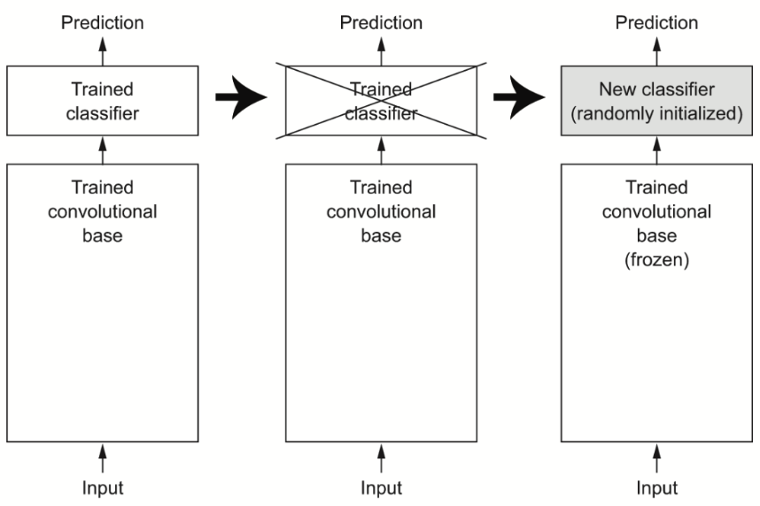

# Chapter 8. Image classification

## Table of Contents
- [Dense Layer vs Convolution Layer](#dense-layer-vs-convolution-layer)
- [합성곱 신경망 (CNNs)](#합성곱-신경망-cnns)
- [패딩과 스트라이드](#패딩과-스트라이드)
- [풀링(Pooling)](#풀링pooling)
- [과적합과 데이터 증강](#과적합과-데이터-증강)
- [전이학습과 사전학습 모델](#전이학습과-사전학습-모델)
- [특징 추출 vs 파인튜닝](#특징-추출-vs-파인튜닝)
- [부분 파인튜닝](#부분-파인튜닝)
- [내가 이해한 핵심](#내가-이해한-핵심)
- [코드](#코드)

---

## Dense Layer vs Convolution Layer


- **Dense Layer**: 입력 전체를 대상으로 **전역 패턴** 학습  
- **Convolution Layer**: 작은 2D 윈도우에서 **국소 패턴** 학습  

→ CNN은 이미지의 공간적 구조를 포착하는 데 강점이 있음  

---

## 합성곱 신경망 (CNNs)


- **평행 이동 불변성(translation invariance)**: 패턴이 위치가 달라져도 인식  
- **계층적 특징 학습**: 단순한 특징(에지, 질감) → 복잡한 특징(형태, 객체)  
- **Feature map**: 각 필터가 활성화된 공간적 분포를 나타냄  

---

## 패딩과 스트라이드
- **패딩 (padding)**  
  - `"valid"`: 패딩 없음 → 출력 크기 감소  
  - `"same"`: 패딩 추가 → 출력 크기 = 입력 크기 유지  
- **스트라이드 (stride)**  
  - 윈도우 이동 간격  
  - 기본값 = 1  
  - stride=2 → 너비·높이 절반으로 다운샘플링  

---

## 풀링(Pooling)
- **Max Pooling**  
  - 2×2 윈도우 + stride=2 → feature map 크기 절반 감소  
  - 국소 패치에서 가장 강한 활성값만 선택 → 특징 존재 여부를 잘 반영  
- 평균 풀링이나 strided conv보다 **특징 보존력이 우수**  

---

## 과적합과 데이터 증강
- **과적합** = 데이터가 적을 때 모델이 학습 데이터를 외워서 일반화 못함  
- **데이터 증강** = 원본 이미지를 다양한 랜덤 변환 → 새로운 샘플 생성  
  - 모델이 동일한 이미지를 두 번 보지 않게 하여 일반화 성능 향상  
- 하지만 증강만으로는 부족 → **Dropout** 추가 필요  

---

## 전이학습과 사전학습 모델
- **사전학습 모델(pretrained model)** = 대규모 데이터셋(ImageNet 등)으로 학습된 모델  
- 학습된 **계층적 특징 표현**을 새로운 과제에 재활용 가능  
- 장점: 작은 데이터셋에서도 좋은 성능 발휘  
- 예: ImageNet(동물, 사물) → 가구 분류로 재사용  

---

## 특징 추출 vs 파인튜닝


- **특징 추출(feature extraction)**  
  - 사전학습된 conv base → feature map 추출 → 새로운 classifier 학습  
  - 장점: 빠르고 계산 효율적  
  - 단점: 데이터 증강 불가  

- **엔드 투 엔드 학습**  
  - conv base + Dense layer 전체 학습  
  - 장점: 데이터 증강 가능  
  - 단점: 계산 비용 큼  

- **Layer freezing**: conv base의 가중치를 고정하여 사전학습된 표현을 보존  

---

## 부분 파인튜닝
- 대규모 pretrained model → **상위 일부 layer만 파인튜닝**  
- 이유:  
  - 하위 layer = 일반적인 특징 (에지, 색상, 질감) → 재사용 가치 높음  
  - 상위 layer = 특정 태스크 특화 특징 → 새 문제에 맞게 조정 필요  
  - 파라미터가 많을수록 과적합 위험 ↑  
- 예: Xception (약 1,500만 파라미터) → 상위 layer만 fine-tune  

---

## 내가 이해한 핵심
- Dense vs Conv: 전역 패턴 vs 국소 패턴 학습  
- CNN: 이동 불변성 + 계층적 특징 학습  
- Padding/Stride: 출력 크기 조절  
- Max Pooling: 특징 존재 여부를 효과적으로 추출  
- 과적합 → 데이터 증강 + Dropout  
- 전이학습 = pretrained conv base 재사용 → 작은 데이터셋에 강력  
- 특징 추출 vs 파인튜닝: 효율성과 적응성의 trade-off  
- 부분 파인튜닝: 상위 layer만 조정해 과적합 최소화  

---

## 코드
<details>
<summary>코드 보기</summary>

```python
### 1. Environment Setup
import os
os.environ["KERAS_BACKEND"] = "jax"

from IPython.core.magic import register_cell_magic

@register_cell_magic
def backend(line, cell):
    current, required = os.environ.get("KERAS_BACKEND", ""), line.split()[-1]
    if current == required:
        get_ipython().run_cell(cell)
    else:
        print(
            f"This cell requires the {required} backend. To run it, change KERAS_BACKEND to "
            f"\"{required}\" at the top of the notebook, restart the runtime, and rerun the notebook."
        )
### 2. Download and Extract Data
import kagglehub

kagglehub.login()
download_path = kagglehub.competition_download("dogs-vs-cats")

import zipfile

with zipfile.ZipFile(download_path + "/train.zip", "r") as zip_ref:
    zip_ref.extractall(".")
### 3. Prepare Dataset (Train / Validation / Test)
import os, shutil, pathlib

original_dir = pathlib.Path("train")
new_base_dir = pathlib.Path("dogs_vs_cats_small")

def make_subset(subset_name, start_index, end_index):
    for category in ("cat", "dog"):
        dir = new_base_dir / subset_name / category
        os.makedirs(dir)
        fnames = [f"{category}.{i}.jpg" for i in range(start_index, end_index)]
        for fname in fnames:
            shutil.copyfile(src=original_dir / fname, dst=dir / fname)

make_subset("train", start_index=0, end_index=1000)
make_subset("validation", start_index=1000, end_index=1500)
make_subset("test", start_index=1500, end_index=2500)
### 4. Load Data
from keras.utils import image_dataset_from_directory

batch_size = 64
image_size = (180, 180)
train_dataset = image_dataset_from_directory(
    new_base_dir / "train", image_size=image_size, batch_size=batch_size
)
validation_dataset = image_dataset_from_directory(
    new_base_dir / "validation", image_size=image_size, batch_size=batch_size
)
test_dataset = image_dataset_from_directory(
    new_base_dir / "test", image_size=image_size, batch_size=batch_size
)
### 5. Data Augmentation
import keras
from keras import layers
import tensorflow as tf

data_augmentation_layers = [
    layers.RandomFlip("horizontal"),
    layers.RandomRotation(0.1),
    layers.RandomZoom(0.2),
]

def data_augmentation(images, targets):
    for layer in data_augmentation_layers:
        images = layer(images)
    return images, targets

augmented_train_dataset = train_dataset.map(
    data_augmentation, num_parallel_calls=8
)
augmented_train_dataset = augmented_train_dataset.prefetch(tf.data.AUTOTUNE)
### 6. Load Pretrained Model (Xception)
import keras_hub

conv_base = keras_hub.models.Backbone.from_preset(
    "xception_41_imagenet",
    trainable=False,
)
preprocessor = keras_hub.layers.ImageConverter.from_preset(
    "xception_41_imagenet",
    image_size=(180, 180),
)
conv_base.trainable = False
len(conv_base.trainable_weights)
### 7. Build Model (Feature Extraction)
inputs = keras.Input(shape=(180, 180, 3))
x = preprocessor(inputs)
x = conv_base(x)
x = layers.GlobalAveragePooling2D()(x)
x = layers.Dense(256)(x)
x = layers.Dropout(0.25)(x)
outputs = layers.Dense(1, activation="sigmoid")(x)
model = keras.Model(inputs, outputs)
model.compile(
    loss="binary_crossentropy",
    optimizer="adam",
    metrics=["accuracy"],
)
### 8. Train Model (Feature Extraction)
callbacks = [
    keras.callbacks.ModelCheckpoint(
        filepath="feature_extraction_with_data_augmentation.keras",
        save_best_only=True,
        monitor="val_loss",
    )
]
history = model.fit(
    augmented_train_dataset,
    epochs=30,
    validation_data=validation_dataset,
    callbacks=callbacks,
)
test_model = keras.models.load_model(
    "feature_extraction_with_data_augmentation.keras"
)
test_loss, test_acc = test_model.evaluate(test_dataset)
print(f"Test accuracy: {test_acc:.3f}")
### 9. Prepare for Fine-Tuning
conv_base.trainable = True

for layer in conv_base.layers[:-4]:
    layer.trainable = False
    
for layer in conv_base.layers:
    if isinstance(layer, layers.BatchNormalization):
        layer.trainable = False
### 10. Train Model (Fine-Tuning)
model.compile(
    loss="binary_crossentropy",
    optimizer=keras.optimizers.Adam(learning_rate=1e-5),
    metrics=["accuracy"],
)

callbacks = [
    keras.callbacks.ModelCheckpoint(
        filepath="fine_tuning.keras",
        save_best_only=True,
        monitor="val_loss",
    )
]
history = model.fit(
    augmented_train_dataset,
    epochs=30,
    validation_data=validation_dataset,
    callbacks=callbacks,
)
model = keras.models.load_model("fine_tuning.keras")
test_loss, test_acc = model.evaluate(test_dataset)
print(f"Test accuracy: {test_acc:.3f}")
len(conv_base.trainable_weights)
```
</details> 
