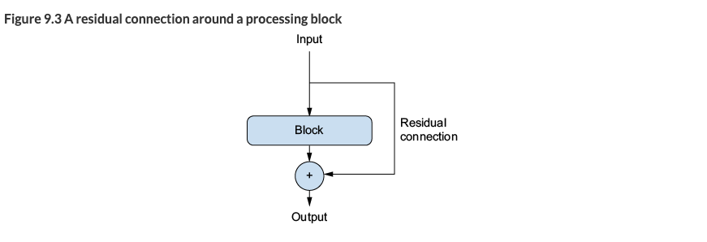
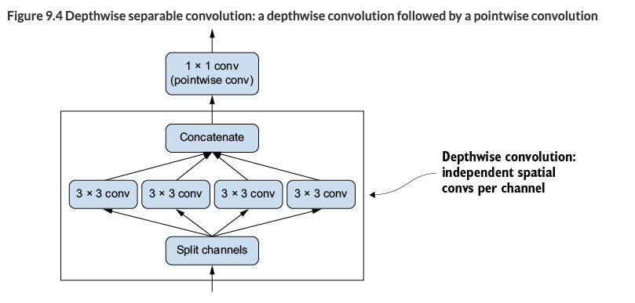

# Chapter 9. ConvNet architecture patterns

## Table of Contents
- [Residual Connections](#residual-connections)  
- [Batch Normalization](#batch-normalization)  
- [Depthwise Separable Convolutions](#depthwise-separable-convolutions)  
- [ConvNet Architecture Principles](#convnet-architecture-principles)  
- [Vision Transformers (ViTs)](#vision-transformers-vits)  
- [Key Takeaways](#key-takeaways)  
- [Code](#code)  
- [📖 Original Text](#-original-text)  

---

## Residual Connections


- **Problem**: Deep networks suffer from **vanishing gradients** → training fails  
- **Solution**: Add residual connections  
  - Add input back to output as an **information shortcut**  
  - Ensures gradient flows back to early layers without loss  
- If input and output shapes differ → use `1×1 Conv2D` projection  

---

## Batch Normalization
- Introduced by Ioffe & Szegedy (2015)  
- Normalizes batch statistics (mean, variance) during training  
- Benefits:  
  - Improves gradient flow → enables **deeper networks**  
  - Widely used in ResNet, EfficientNet, Xception, etc.  
- Best Practice:
  ```python
  x = layers.Conv2D(32, 3, use_bias=False)(x)
  x = layers.BatchNormalization()(x)
  x = layers.Activation("relu")(x)
  ```
  → Normalize before activation (better ReLU utilization)  

- **Fine-tuning tip**: Freeze BatchNorm layers (`trainable=False`) for stability  

---

## Depthwise Separable Convolutions


- Efficient alternative to Conv2D  
- Two steps:  
  - Depthwise convolution (per-channel)  
  - Pointwise convolution (1×1 conv)  
- Advantages:  
  - Fewer parameters, less computation  
  - Faster convergence, less overfitting  
- Used in MobileNet, Xception  

---

## ConvNet Architecture Principles
- Use repeated blocks (Conv → Conv → Pooling)  
- Increase filters as feature maps shrink  
- Deep & narrow > shallow & wide  
- Add residual connections for stable training  
- Use BatchNorm to stabilize gradients  
- Prefer SeparableConv2D for efficiency  

---

## Vision Transformers (ViTs)
- Images split into patches → processed as sequences in Transformer  
- Advantages:  
  - Better at learning **long-range dependencies**  
  - Scales well with large datasets  
- Limitations:  
  - No spatial prior → less data efficient than ConvNets  
  - Require very large datasets (e.g., ImageNet) to be effective  

---

## Key Takeaways
- **Residual connections** = fix vanishing gradients, enable deep training  
- **Batch Normalization** = stabilize gradients, allow deeper models  
- **Depthwise Separable Conv** = fewer parameters, efficient training  
- **Design principles**:  
  - Repeated blocks  
  - More filters as spatial size decreases  
  - Deep & narrow > shallow & wide  
- **ViTs** = powerful for large datasets, but ConvNets are better for small data  

---

## Code
<details>
<summary>Show code</summary>

```python
### Residual Block Implementation
inputs = keras.Input(shape=(32, 32, 3))
x = layers.Rescaling(1.0 / 255)(inputs)

def residual_block(x, filters, pooling=False):
    residual = x
    x = layers.Conv2D(filters, 3, activation="relu", padding="same")(x)
    x = layers.Conv2D(filters, 3, activation="relu", padding="same")(x)
    if pooling:
        x = layers.MaxPooling2D(2, padding="same")(x)
        residual = layers.Conv2D(filters, 1, strides=2)(residual)
    elif filters != residual.shape[-1]:
        residual = layers.Conv2D(filters, 1)(residual)
    x = layers.add([x, residual])
    return x

x = residual_block(x, filters=32, pooling=True)
x = residual_block(x, filters=64, pooling=True)
x = residual_block(x, filters=128, pooling=False)

x = layers.GlobalAveragePooling2D()(x)
outputs = layers.Dense(1, activation="sigmoid")(x)
model = keras.Model(inputs=inputs, outputs=outputs)
```

```python
''' 
All of these ideas together into a single model
- Your model should be organized into repeated blocks of layers, usually made of multiple convolution layers and a max pooling layer.
- The number of filters in your layers should increase as the size of the spatial feature maps decreases.
- Deep and narrow is better than broad and shallow.
- Introducing residual connections around blocks of layers helps you train deeper networks.
- It can be beneficial to introduce batch normalization layers after your convolution layers.
- It can be beneficial to replace Conv2D layers with SeparableConv2D layers, which are more parameter efficient.
'''
import keras
inputs = keras.Input(shape=(180, 180, 3))
x = layers.Rescaling(1.0 / 255)(inputs)
x = layers.Conv2D(filters=32, kernel_size=5, use_bias=False)(x)

for size in [32, 64, 128, 256, 512]:
    residual = x

    x = layers.BatchNormalization()(x)
    x = layers.Activation("relu")(x)
    x = layers.SeparableConv2D(size, 3, padding="same", use_bias=False)(x)

    x = layers.BatchNormalization()(x)
    x = layers.Activation("relu")(x)
    x = layers.SeparableConv2D(size, 3, padding="same", use_bias=False)(x)

    x = layers.MaxPooling2D(3, strides=2, padding="same")(x)

    residual = layers.Conv2D(
        size, 1, strides=2, padding="same", use_bias=False
    )(residual)
    x = layers.add([x, residual])

x = layers.GlobalAveragePooling2D()(x)
x = layers.Dropout(0.5)(x)
outputs = layers.Dense(1, activation="sigmoid")(x)
model = keras.Model(inputs=inputs, outputs=outputs)
```
</details>  

---

## 📖 Original Text
<details>
<summary>Show original</summary>

**Modularity, hierarchy, and reuse**

If you want to make a complex system simpler, there’s a universal recipe you can apply: just structure your amorphous soup of complexity into modules, organize the modules into a hierarchy, and start reusing the same modules in multiple places as appropriate (“reuse” is another word for abstraction). That’s the modularity-hierarchy-reuse (MHR) formula, and it underlies system architecture across pretty much every domain where the term architecture is used. It’s at the heart of the organization of any system of meaningful complexity, whether it’s a cathedral, your own body, the US Navy, or the Keras codebase.

**Residual Connections**

If your function chain is too deep, this noise starts overwhelming gradient information, and backpropagation stops working. Your model won’t train at all. This is called the vanishing gradients problem.

The fix is simple: just force each function in the chain to be nondestructive—to retain a noiseless version of the information contained in the previous input. The easiest way to implement this is called a residual connection. It’s dead easy: just add the input of a layer or block of layers back to its output (see figure 9.3). The residual connection acts as an information shortcut around destructive or noisy blocks (such as blocks that contain ReLU activations or dropout layers), enabling error gradient information from early layers to propagate noiselessly through a deep network.

Note that adding the input back to the output of a block implies that the output should have the same shape as the input. This is not the case if your block includes convolutional layers with an increased number of filters or a max pooling layer. In such cases, use a 1 × 1 Conv2D layer with no activation to linearly project the residual to the desired output shape. You’d typically use padding="same" in the convolution layers in your target block to avoid spatial downsampling due to padding, and you’d use strides in the residual projection to match any downsampling caused by a max pooling layer.

With residual connections, you can build networks of arbitrary depth, without having to worry about vanishing gradients.

**Batch normalization**

Batch normalization does just that. It’s a type of layer (BatchNormalization in Keras) introduced in 2015 by Ioffe and Szegedy;2 it can adaptively normalize data even as the mean and variance change over time during training. During training, it uses the mean and variance of the current batch of data to normalize samples, and during inference (when a big enough batch of representative data may not be available), it uses an exponential moving average of the batchwise mean and variance of the data seen during training.

Although Ioffe and Szegedy’s original paper suggested that batch normalization operates by “reducing internal covariate shift,” no one really knows for sure why batch normalization helps. There are various hypotheses but no certitudes. You’ll find that this is true of many things in deep learning—deep learning is not an exact science but a set of ever-changing, empirically derived engineering best practices, woven together by unreliable narratives. You will sometimes feel like the book you have in hand tells you how to do something but doesn’t quite satisfactorily say why it works: that’s because we know the how but we don’t know the why. Whenever a reliable explanation is available, we make sure to mention it. Batch normalization isn’t one of those cases.

In practice, the main effect of batch normalization appears to be that it helps with gradient propagation—much like residual connections—and thus allows for deeper networks. Some very deep networks can only be trained if they include multiple BatchNormalization layers. For instance, batch normalization is used liberally in many of the advanced ConvNet architectures that come packaged with Keras, such as ResNet50, Efficient­Net, and Xception.

Importantly, I generally recommend placing the previous layer’s activation after the batch normalization layer (although this is still a subject of debate). So instead of doing
```python
x = layers.Conv2D(32, 3, activation="relu")(x)
x = layers.BatchNormalization()(x)
```
you would actually do the following:
```python
x = layers.Conv2D(32, 3, use_bias=False)(x)                          
x = layers.BatchNormalization()(x)
x = layers.Activation("relu")(x)      
```
The intuitive reason why is that batch normalization will center your inputs on zero, while your ReLU activation uses zero as a pivot for keeping or dropping activated channels: doing normalization before the activation maximizes the utilization of the ReLU. That said, this ordering best practice is not exactly critical, so if you do convolution-­activation-batch normalization, your model will still train, and you won’t necessarily see worse results.

Batch normalization has many quirks. One of the main ones relates to fine-tuning: when fine-tuning a model that includes BatchNormalization layers, I recommend leaving these layers frozen (set their trainable attribute to False). Otherwise, they will keep updating their internal mean and variance, which can interfere with the very small updates applied to the surrounding Conv2D layers.

**Depthwise separable convolutions**

What if we told you that there’s a layer you can use as a drop-in replacement for Conv2D that will make your model smaller (fewer trainable weight parameters), leaner (fewer floating-point operations), and cause it to perform a few percentage points better on its task? That is precisely what the depthwise separable convolution layer does (Separable­Conv2D in Keras). This layer performs a spatial convolution on each channel of its input, independently, before mixing output channels via a pointwise convolution (a 1 × 1 convolution).

Depthwise separable convolution relies on the assumption that spatial locations in intermediate activations are highly correlated, but different channels are highly independent. Because this assumption is generally true for the image representations learned by deep neural networks, it serves as a useful prior that helps the model make more efficient use of its training data. A model with stronger priors about the structure of the information it will have to process is a better model—as long as the priors are accurate.

Depthwise separable convolution requires significantly fewer parameters and involves fewer computations compared to regular convolution, while having comparable representational power. They result in smaller models that converge faster and are less prone to overfitting. These advantages become especially important when you’re training small models from scratch on limited data.

As a reminder, here are the ConvNet architecture principles you’ve learned so far:
- Your model should be organized into repeated blocks of layers, usually made of multiple convolution layers and a max pooling layer.
- The number of filters in your layers should increase as the size of the spatial feature maps decreases.
- Deep and narrow is better than broad and shallow.
- Introducing residual connections around blocks of layers helps you train deeper networks.
- It can be beneficial to introduce batch normalization layers after your convolution layers.
- It can be beneficial to replace Conv2D layers with SeparableConv2D layers, which are more parameter efficient.

**Beyond convolution: Vision Transformers**

ViTs are a type of Transformer, they also process sequences: they split up an image into a 1D sequence of patches, turn each patch into a flat vector, and process the vector sequence. The Transformer architecture allows ViTs to capture long-range relationships between different parts of the image, something ConvNets can sometimes struggle with.

Our general experience with Transformers is that they’re a great choice if you’re working with a massive dataset. They’re simply better at utilizing large amounts of data. However, for smaller datasets, they tend to be suboptimal for two reasons. First, they lack the spatial prior of ConvNets—the 2D patch-based architecture of ConvNets incorporates more assumptions about the local structure of the visual space, making them more data efficient. Second, for ViTs to shine, they need to be really large. They end up being unwieldy for anything smaller than ImageNet.

The battle for image recognition supremacy is far from over, but ViTs have undoubtedly opened a new and exciting chapter. For your small-scale image classification needs, however, ConvNets remain your best bet.
</details>
