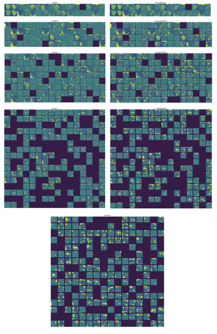
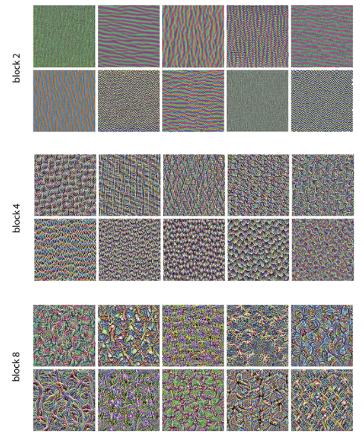

# Chapter 10. Interpreting what ConvNets learn

## Table of Contents

* [Interpretability in ConvNets](#interpretability-in-convnets)
* [Visualizing Intermediate Activations](#visualizing-intermediate-activations)
* [Visualizing ConvNet Filters](#visualizing-convnet-filters)
* [Filter Visualization Loop & Postprocessing](#filter-visualization-loop--postprocessing)
* [Class Activation Maps (Grad-CAM)](#class-activation-maps-gradcam)
* [Latent Space Visualization](#latent-space-visualization)
* [Key Takeaways](#key-takeaways)

---

## Interpretability in ConvNets

* **문제의식**: 모델이 왜 특정 클래스로 분류했는지(예: 냉장고 vs 트럭)를 이해하는 것은 중요. 특히 의료영상처럼 고위험 분야에서 필수.
* **주장**: ConvNet은 완전히 “블랙박스”가 아님. 시각적 개념을 학습하므로 **시각화하기 쉬움**.
* **해석 도구 (4가지)**

  * **중간 활성화**: 레이어별 입력 분해 과정 보기.
  * **필터 시각화**: 각 필터가 선호하는 패턴.
  * **클래스 활성화 맵 (CAM/Grad-CAM)**: 분류 근거가 된 이미지 영역.
  * **잠재 공간 시각화**: 데이터의 의미적 구조, 이상치/애매한 샘플 확인.

---

## Visualizing Intermediate Activations

* **정의**: 입력 이미지를 통과시킨 뒤 Conv/Pooling 레이어의 출력(feature map)을 2D로 보여줌.
* **왜 필요한가**:

  * 초기 레이어 → **엣지/단순 텍스처**, 원본 정보 대부분 유지.
  * 심층 레이어 → **추상적 파트/개념**(예: 고양이 귀), 구체적 디테일은 줄고 클래스 관련 정보가 강화.
  * **희소성 증가**: 깊어질수록 활성화되지 않는 채널이 많아짐.
* **방법**:

  1. 다중 출력 모델로 레이어별 결과 추출.
  2. 이미지 전처리 후 예측.
  3. 각 채널을 2D 이미지로 시각화.
* **핵심 통찰**: 딥러닝은 **정보 정제 파이프라인** — 불필요한 디테일 제거, 유용한 정보 증폭.

---

## Visualizing ConvNet Filters

* **목표**: 특정 필터를 가장 강하게 활성화하는 입력 이미지를 합성.
* **방법**: 입력 공간에서의 **그래디언트 상승**

  * 손실 = 타깃 필터의 평균 활성화.
  * ∂loss/∂image 방향으로 이미지 갱신.
  * 업데이트 시 **L2 정규화**로 안정성 확보.
* **모델**: ImageNet 학습된 **Xception** 백본 사용, 예: `block3_sepconv1`.
* **해석**:

  * 얕은 레이어 = **엣지/색상**.
  * 중간 레이어 = **간단한 텍스처**.
  * 깊은 레이어 = **자연 이미지 모티프** (깃털, 눈, 잎사귀).

---

## Filter Visualization Loop & Postprocessing

* **루프**: 여러 필터(예: 64개)에 대해 30회 정도 갱신 반복.
* **후처리**: 평균 0, 분산 1로 정규화 후 [0,255] 범위로 스케일링 → `uint8` 변환, 테두리 크롭.
* **표현**: `n×n` 격자로 배치, 저장(`keras.utils.save_img`).
* **실용 팁**:

  * 초기 이미지는 작은 랜덤값(0.4~0.6).
  * 학습률 10, 30회 반복 적절.
  * 죽은 필터는 활성화 크기로 판별.

---

## Class Activation Maps (Grad-CAM)

* **목적**: 분류 결정에 영향을 준 이미지 **영역**을 찾아내어 해석성 확보.
* **절차**:

  1. 입력 → 마지막 conv 레이어 출력 + 최종 예측.
  2. 상위 클래스 점수에 대한 conv feature의 **그래디언트 계산**.
  3. 채널별 그래디언트 **평균값 → 가중치**.
  4. 채널 가중치 합산 → heatmap.
  5. [0,1] 정규화 → 리사이즈 → 원본 위에 합성(JET colormap).
* **백엔드**: TF / PyTorch / JAX 모두 구현 가능.
* **읽는 법**: 밝은 영역 = 클래스 신호 강함.

  * 예시: 코끼리 귀가 **아프리카 vs 인도** 코끼리를 구분하는 핵심 특징.

---

## Latent Space Visualization

* **개념**: 각 레이어는 입력을 **잠재 공간(latent space)**에 임베딩. 가까운 점 = 의미적으로 유사한 데이터.
* **방법**:

  * 보통 마지막 직전 레이어의 활성화 추출.
  * 데이터셋 전체에 대해 임베딩 수집.
  * 고차원 → 2D로 투영 (t-SNE, UMAP).
* **주의**: 투영 과정은 구조를 왜곡 가능. 패턴 해석은 정성적으로만.

---

## Key Takeaways

* 초기 레이어는 **엣지**, 심층 레이어는 **개념**; 깊어질수록 희소성이 증가.
* **그래디언트 상승**으로 각 필터가 선호하는 입력 패턴 확인 가능.
* **predict()**는 값 추출용, **model(x)**는 미분/그래디언트 필요할 때 사용.
* **Grad-CAM**은 마지막 conv 특징맵 가중합으로 **설명 가능한 시각화** 제공.
* **잠재 공간 투영**은 데이터 품질 점검(이상치, 모호한 샘플 탐지)에 유용.
* 이러한 시각화 도구는 단순 설명을 넘어서 **디버깅·데이터 정제·신뢰 확보**에 도움을 줌.
