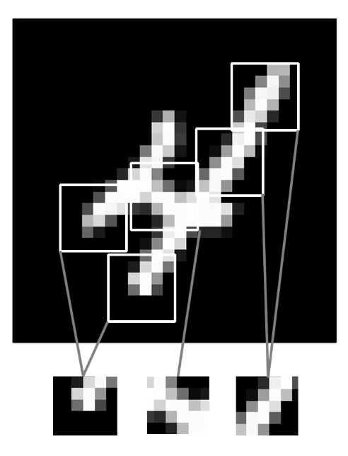
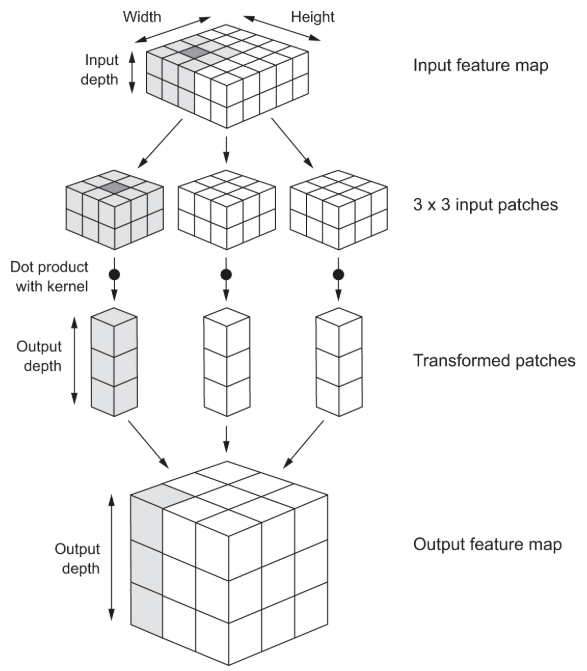

# Chapter 8. Image classification

## Table of Contents
- [Dense Layer vs Convolution Layer](#dense-layer-vs-convolution-layer)
- [합성곱 신경망 (CNNs)](#합성곱-신경망-cnns)
- [패딩과 스트라이드](#패딩과-스트라이드)
- [풀링(Pooling)](#풀링pooling)
- [과적합과 데이터 증강](#과적합과-데이터-증강)
- [전이학습과 사전학습 모델](#전이학습과-사전학습-모델)
- [특징 추출 vs 파인튜닝](#특징-추출-vs-파인튜닝)
- [부분 파인튜닝](#부분-파인튜닝)
- [내가 이해한 핵심](#내가-이해한-핵심)
- [코드](#코드)
- [📖 원문 발췌](#-원문-발췌)

---

## Dense Layer vs Convolution Layer


- **Dense Layer**: 입력 전체를 대상으로 **전역 패턴** 학습  
- **Convolution Layer**: 작은 2D 윈도우에서 **국소 패턴** 학습  

→ CNN은 이미지의 공간적 구조를 포착하는 데 강점이 있음  

---

## 합성곱 신경망 (CNNs)


- **평행 이동 불변성(translation invariance)**: 패턴이 위치가 달라져도 인식  
- **계층적 특징 학습**: 단순한 특징(에지, 질감) → 복잡한 특징(형태, 객체)  
- **Feature map**: 각 필터가 활성화된 공간적 분포를 나타냄  

---

## 패딩과 스트라이드
- **패딩 (padding)**  
  - `"valid"`: 패딩 없음 → 출력 크기 감소  
  - `"same"`: 패딩 추가 → 출력 크기 = 입력 크기 유지  
- **스트라이드 (stride)**  
  - 윈도우 이동 간격  
  - 기본값 = 1  
  - stride=2 → 너비·높이 절반으로 다운샘플링  

---

## 풀링(Pooling)
- **Max Pooling**  
  - 2×2 윈도우 + stride=2 → feature map 크기 절반 감소  
  - 국소 패치에서 가장 강한 활성값만 선택 → 특징 존재 여부를 잘 반영  
- 평균 풀링이나 strided conv보다 **특징 보존력이 우수**  

---

## 과적합과 데이터 증강
- **과적합** = 데이터가 적을 때 모델이 학습 데이터를 외워서 일반화 못함  
- **데이터 증강** = 원본 이미지를 다양한 랜덤 변환 → 새로운 샘플 생성  
  - 모델이 동일한 이미지를 두 번 보지 않게 하여 일반화 성능 향상  
- 하지만 증강만으로는 부족 → **Dropout** 추가 필요  

---

## 전이학습과 사전학습 모델
- **사전학습 모델(pretrained model)** = 대규모 데이터셋(ImageNet 등)으로 학습된 모델  
- 학습된 **계층적 특징 표현**을 새로운 과제에 재활용 가능  
- 장점: 작은 데이터셋에서도 좋은 성능 발휘  
- 예: ImageNet(동물, 사물) → 가구 분류로 재사용  

---

## 특징 추출 vs 파인튜닝


- **특징 추출(feature extraction)**  
  - 사전학습된 conv base → feature map 추출 → 새로운 classifier 학습  
  - 장점: 빠르고 계산 효율적  
  - 단점: 데이터 증강 불가  

- **엔드 투 엔드 학습**  
  - conv base + Dense layer 전체 학습  
  - 장점: 데이터 증강 가능  
  - 단점: 계산 비용 큼  

- **Layer freezing**: conv base의 가중치를 고정하여 사전학습된 표현을 보존  

---

## 부분 파인튜닝
- 대규모 pretrained model → **상위 일부 layer만 파인튜닝**  
- 이유:  
  - 하위 layer = 일반적인 특징 (에지, 색상, 질감) → 재사용 가치 높음  
  - 상위 layer = 특정 태스크 특화 특징 → 새 문제에 맞게 조정 필요  
  - 파라미터가 많을수록 과적합 위험 ↑  
- 예: Xception (약 1,500만 파라미터) → 상위 layer만 fine-tune  

---

## 내가 이해한 핵심
- Dense vs Conv: 전역 패턴 vs 국소 패턴 학습  
- CNN: 이동 불변성 + 계층적 특징 학습  
- Padding/Stride: 출력 크기 조절  
- Max Pooling: 특징 존재 여부를 효과적으로 추출  
- 과적합 → 데이터 증강 + Dropout  
- 전이학습 = pretrained conv base 재사용 → 작은 데이터셋에 강력  
- 특징 추출 vs 파인튜닝: 효율성과 적응성의 trade-off  
- 부분 파인튜닝: 상위 layer만 조정해 과적합 최소화  

---

## 코드
<details>
<summary>코드 보기</summary>

```python
### 1. Environment Setup
import os
os.environ["KERAS_BACKEND"] = "jax"

from IPython.core.magic import register_cell_magic

@register_cell_magic
def backend(line, cell):
    current, required = os.environ.get("KERAS_BACKEND", ""), line.split()[-1]
    if current == required:
        get_ipython().run_cell(cell)
    else:
        print(
            f"This cell requires the {required} backend. To run it, change KERAS_BACKEND to "
            f"\"{required}\" at the top of the notebook, restart the runtime, and rerun the notebook."
        )
### 2. Download and Extract Data
import kagglehub

kagglehub.login()
download_path = kagglehub.competition_download("dogs-vs-cats")

import zipfile

with zipfile.ZipFile(download_path + "/train.zip", "r") as zip_ref:
    zip_ref.extractall(".")
### 3. Prepare Dataset (Train / Validation / Test)
import os, shutil, pathlib

original_dir = pathlib.Path("train")
new_base_dir = pathlib.Path("dogs_vs_cats_small")

def make_subset(subset_name, start_index, end_index):
    for category in ("cat", "dog"):
        dir = new_base_dir / subset_name / category
        os.makedirs(dir)
        fnames = [f"{category}.{i}.jpg" for i in range(start_index, end_index)]
        for fname in fnames:
            shutil.copyfile(src=original_dir / fname, dst=dir / fname)

make_subset("train", start_index=0, end_index=1000)
make_subset("validation", start_index=1000, end_index=1500)
make_subset("test", start_index=1500, end_index=2500)
### 4. Load Data
from keras.utils import image_dataset_from_directory

batch_size = 64
image_size = (180, 180)
train_dataset = image_dataset_from_directory(
    new_base_dir / "train", image_size=image_size, batch_size=batch_size
)
validation_dataset = image_dataset_from_directory(
    new_base_dir / "validation", image_size=image_size, batch_size=batch_size
)
test_dataset = image_dataset_from_directory(
    new_base_dir / "test", image_size=image_size, batch_size=batch_size
)
### 5. Data Augmentation
import keras
from keras import layers
import tensorflow as tf

data_augmentation_layers = [
    layers.RandomFlip("horizontal"),
    layers.RandomRotation(0.1),
    layers.RandomZoom(0.2),
]

def data_augmentation(images, targets):
    for layer in data_augmentation_layers:
        images = layer(images)
    return images, targets

augmented_train_dataset = train_dataset.map(
    data_augmentation, num_parallel_calls=8
)
augmented_train_dataset = augmented_train_dataset.prefetch(tf.data.AUTOTUNE)
### 6. Load Pretrained Model (Xception)
import keras_hub

conv_base = keras_hub.models.Backbone.from_preset(
    "xception_41_imagenet",
    trainable=False,
)
preprocessor = keras_hub.layers.ImageConverter.from_preset(
    "xception_41_imagenet",
    image_size=(180, 180),
)
conv_base.trainable = False
len(conv_base.trainable_weights)
### 7. Build Model (Feature Extraction)
inputs = keras.Input(shape=(180, 180, 3))
x = preprocessor(inputs)
x = conv_base(x)
x = layers.GlobalAveragePooling2D()(x)
x = layers.Dense(256)(x)
x = layers.Dropout(0.25)(x)
outputs = layers.Dense(1, activation="sigmoid")(x)
model = keras.Model(inputs, outputs)
model.compile(
    loss="binary_crossentropy",
    optimizer="adam",
    metrics=["accuracy"],
)
### 8. Train Model (Feature Extraction)
callbacks = [
    keras.callbacks.ModelCheckpoint(
        filepath="feature_extraction_with_data_augmentation.keras",
        save_best_only=True,
        monitor="val_loss",
    )
]
history = model.fit(
    augmented_train_dataset,
    epochs=30,
    validation_data=validation_dataset,
    callbacks=callbacks,
)
test_model = keras.models.load_model(
    "feature_extraction_with_data_augmentation.keras"
)
test_loss, test_acc = test_model.evaluate(test_dataset)
print(f"Test accuracy: {test_acc:.3f}")
### 9. Prepare for Fine-Tuning
conv_base.trainable = True

for layer in conv_base.layers[:-4]:
    layer.trainable = False
    
for layer in conv_base.layers:
    if isinstance(layer, layers.BatchNormalization):
        layer.trainable = False
### 10. Train Model (Fine-Tuning)
model.compile(
    loss="binary_crossentropy",
    optimizer=keras.optimizers.Adam(learning_rate=1e-5),
    metrics=["accuracy"],
)

callbacks = [
    keras.callbacks.ModelCheckpoint(
        filepath="fine_tuning.keras",
        save_best_only=True,
        monitor="val_loss",
    )
]
history = model.fit(
    augmented_train_dataset,
    epochs=30,
    validation_data=validation_dataset,
    callbacks=callbacks,
)
model = keras.models.load_model("fine_tuning.keras")
test_loss, test_acc = model.evaluate(test_dataset)
print(f"Test accuracy: {test_acc:.3f}")
len(conv_base.trainable_weights)
```
</details> 

---

## 📖 원문 발췌

<details>
<summary>원문 보기</summary>
The fundamental difference between a densely-connected layer and a convolution layer is this: Dense layers learn global patterns in their input feature space (for example, for a MNIST digit, patterns involving all pixels), whereas convolution layers learn local patterns: in the case of images, patterns found in small 2D windows of the inputs. 

This key characteristic gives convnets two interesting properties:
- The patterns they learn are translation invariant.
- They can learn spatial hierarchies of patterns 

That is what the term feature map means: every dimension in the depth axis is a feature (or filter), and the rank-2 tensor output[:, :, n] is the 2D spatial map of the response of this filter over the input.

If you want to get an output feature map with the same spatial dimensions as the input, you can use padding. Padding consists of adding an appropriate number of rows and columns on each side of the input feature map so as to make it possible to fit centered convolution windows around every input tile.

In Conv2D layers, padding is configurable via the padding argument, which takes two values: "valid", which means no padding (only valid window locations will be used); and "same", which means “pad in such a way as to have an output with the same width and height as the input.” The padding argument defaults to "valid".

The other factor that can influence output size is the notion of strides. The description of convolution so far has assumed that the center tiles of the convolution windows are all contiguous. But the distance between two successive windows is a parameter of the convolution, called its stride, which defaults to 1. It’s possible to have strided convolutions: convolutions with a stride higher than 1.

Using stride 2 means the width and height of the feature map are downsampled by a factor of 2 (in addition to any changes induced by border effects). Strided convolutions are rarely used in classification models, but they come in handy for some types of models.

Max pooling consists of extracting windows from the input feature maps and outputting the max value of each channel. It’s conceptually similar to convolution, except that instead of transforming local patches via a learned linear transformation (the convolution kernel), they’re transformed via a hardcoded max tensor operation. A big difference from convolution is that max pooling is usually done with 2 × 2 windows and stride 2, in order to downsample the feature maps by a factor of 2. On the other hand, convolution is typically done with 3 × 3 windows and no stride (stride 1).

In a nutshell, the reason is that features tend to encode the spatial presence of some pattern or concept over the different tiles of the feature map (hence, the term feature map), and it’s more informative to look at the maximal presence of different features than at their average presence. So the most reasonable subsampling strategy is to first produce dense maps of features (via unstrided convolutions) and then look at the maximal activation of the features over small patches, rather than looking at sparser windows of the inputs (via strided convolutions) or averaging input patches, which could cause you to miss or dilute feature-presence information.

Overfitting is caused by having too few samples to learn from, rendering you unable to train a model that can generalize to new data. Given infinite data, your model would be exposed to every possible aspect of the data distribution at hand: you would never overfit. Data augmentation takes the approach of generating more training data from existing training samples, by augmenting the samples via a number of random transformations that yield believable-looking images. The goal is that at training time, your model will never see the exact same picture twice. This helps expose the model to more aspects of the data and generalize better.

If you train a new model using this data-augmentation configuration, the model will never see the same input twice. But the inputs it sees are still heavily intercorrelated, because they come from a small number of original images – you can’t produce new information, you can only remix existing information. As such, this may not be enough to completely get rid of overfitting. To further fight overfitting, you’ll also add a Dropout layer to your model, right before the densely connected classifier.

A common and highly effective approach to deep learning on small image datasets is to use a pretrained model. A pretrained model is a model that was previously trained on a large dataset, typically on a large-scale image-classification task. If this original dataset is large enough and general enough, then the spatial hierarchy of features learned by the pretrained model can effectively act as a generic model of the visual world, and hence its features can prove useful for many different computer vision problems, even though these new problems may involve completely different classes than those of the original task. For instance, you might train a model on ImageNet (where classes are mostly animals and everyday objects) and then repurpose this trained model for something as remote as identifying furniture items in images. Such portability of learned features across different problems is a key advantage of deep learning compared to many older, shallow-learning approaches, and it makes deep learning very effective for small-data problems.

There are two ways to use a pretrained model: feature extraction and fine-tuning. 

Feature extraction consists of using the representations learned by a previously-trained model to extract interesting features from new samples. These features are then run through a new classifier, which is trained from scratch.

In the case of convnets, feature extraction consists of taking the convolutional base of a previously-trained network, running the new data through it, and training a new classifier on top of the output.

Why only reuse the convolutional base? Could you reuse the densely-connected classifier as well? In general, doing so should be avoided. The reason is that the representations learned by the convolutional base are likely to be more generic and therefore more reusable: the feature maps of a convnet are presence maps of generic concepts over a picture, which is likely to be useful regardless of the computer vision problem at hand. But the representations learned by the classifier will necessarily be specific to the set of classes on which the model was trained – they will only contain information about the presence probability of this or that class in the entire picture. Additionally, representations found in densely connected layers no longer contain any information about where objects are located in the input image: these layers get rid of the notion of space, whereas the object location is still described by convolutional feature maps. For problems where object location matters, densely connected features are largely useless.

Note that the level of generality (and therefore reusability) of the representations extracted by specific convolution layers depends on the depth of the layer in the model. Layers that come earlier in the model extract local, highly generic feature maps (such as visual edges, colors, and textures), whereas layers that are higher up extract more-abstract concepts (such as “cat ear” or “dog eye”). So if your new dataset differs a lot from the dataset on which the original model was trained, you may be better off using only the first few layers of the model to do feature extraction, rather than using the entire convolutional base.

At this point, there are two ways you could proceed:
1. Running the convolutional base over your dataset, recording its output to a NumPy array on disk, and then using this data as input to a standalone, densely-connected classifier similar to those you saw in part 1 of this book. This solution is fast and cheap to run, because it only requires running the convolutional base once for every input image, and the convolutional base is by far the most expensive part of the pipeline. But for the same reason, this technique won’t allow you to use data augmentation.
2. Extending the model you have (conv_base) by adding Dense layers on top, and running the whole thing end to end on the input data. This will allow you to use data augmentation, because every input image goes through the convolutional base every time it’s seen by the model. But for the same reason, this technique is far more expensive than the first.

Freezing a layer or set of layers means preventing their weights from being updated during training. Here, if you don’t do this, then the representations that were previously learned by the convolutional base will be modified during training. Because the Dense layers on top are randomly initialized, very large weight updates would be propagated through the network, effectively destroying the representations previously learned.

Fine-tuning consists of unfreezing the frozen model base used for feature extraction, and jointly training both the newly added part of the model (in this case, the fully connected classifier) and the base model. This is called fine-tuning because it slightly adjusts the more abstract representations of the model being reused, in order to make them more relevant for the problem at hand.

The steps for fine-tuning a network are as follows:
- Add your custom network on top of an already-trained base network.
- Freeze the base network.
- Train the part you added.
- Unfreeze the base network.
- Jointly train both these layers and the part you added.
Note that you should not unfreeze “batch normalization” layers (BatchNormalization). 

Partial fine-tuning
In this case, we chose to unfreeze and fine-tune all of the Xception convolutional base. However, when dealing with large pretrained models, you may sometimes only unfreeze some of the top layers of the convolutional base, and leave the lower layers frozen. You’re probably wondering, why only fine-tune some of the layers? Why the top ones specifically? Here’s why:
- Earlier layers in the convolutional base encode more-generic, reusable features, whereas layers higher up encode more-specialized features. It’s more useful to fine-tune the more specialized features, because these are the ones that need to be repurposed on your new problem. There would be fast-decreasing returns in fine-tuning lower layers.
- The more parameters you’re training, the more you’re at risk of overfitting. The convolutional base has 15 million parameters, so it would be risky to attempt to train it on your small dataset.
</details>