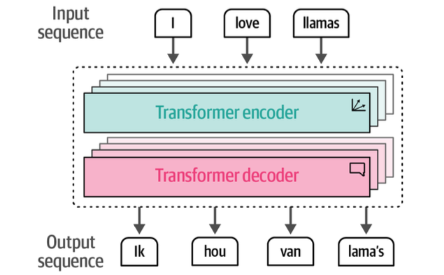
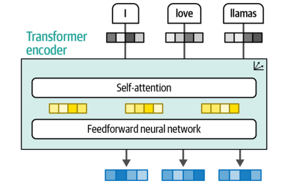
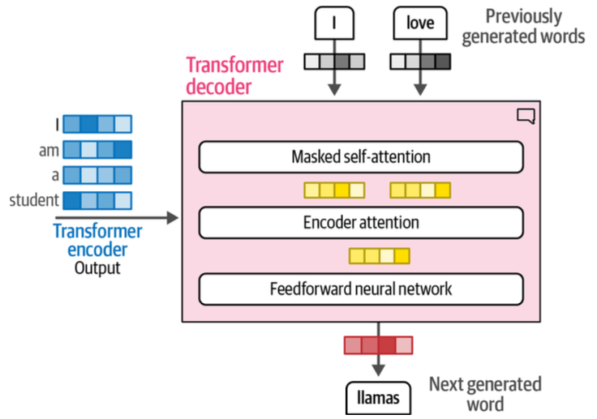
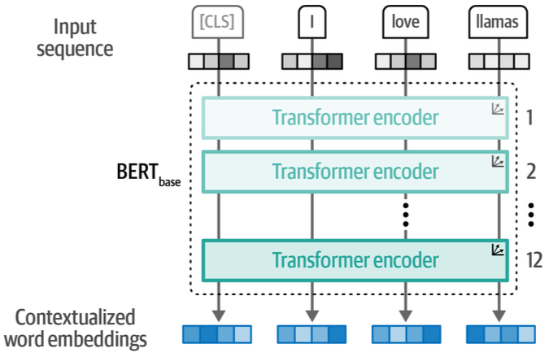
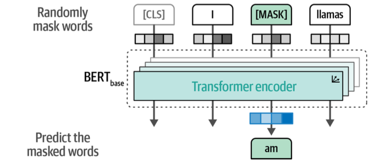
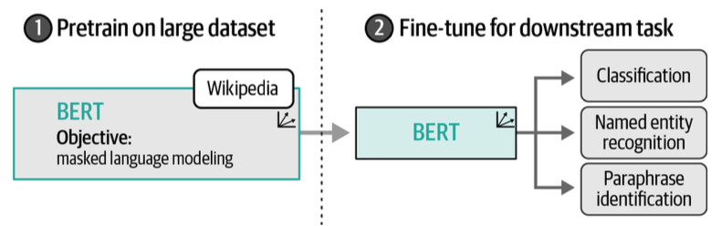
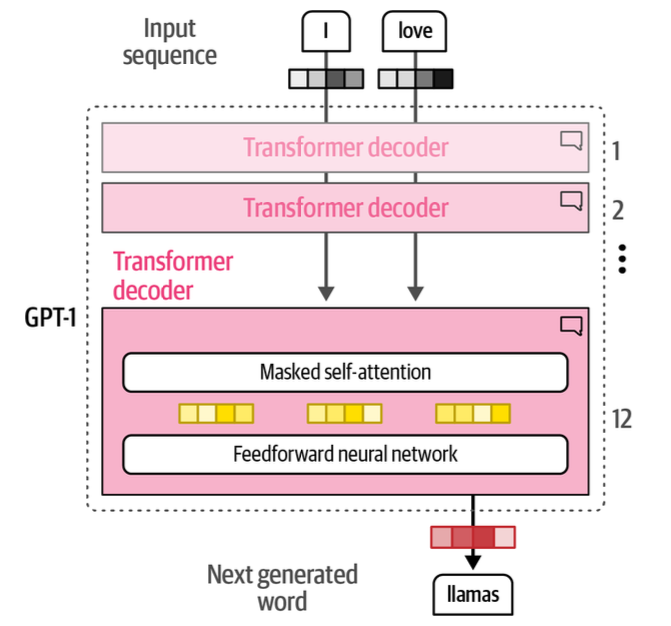
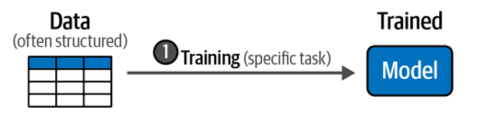

# Chapter 1. An Introduction to Large Language Models

## Table of Contents
- [Embeddings](#embeddings)
- [Transformer Architecture](#transformer-architecture)
- [BERT and Encoder-only Models](#bert-and-encoder-only-models)
- [GPT and Decoder-only Models](#gpt-and-decoder-only-models)
- [LLM Development Process](#llm-development-process)
- [Key Takeaways](#key-takeaways)
- [Code](#code)
- [📖 Original Excerpt](#-original-excerpt)

---

## Embeddings


- **Embeddings** = represent data as vectors that capture semantic meaning  
- Can be created for text, images, audio, and other input types  
- Serve as the foundation for **representation learning** in LLMs, converting context into numerical form  

---

## Transformer Architecture
  
- Transformer = **stacked encoder blocks + decoder blocks**

  
- **Encoder** = Self-Attention + Feedforward NN  
  - Converts input text into contextual vector representations  

  
- **Decoder** = Masked Self-Attention + Encoder Attention + Feedforward NN  
  - Masked Self-Attention: captures contextual relationships among previously generated words  
  - Encoder Attention (Cross-Attention): relates encoder outputs with decoder states, referencing the input sentence  
  - Together, these mechanisms predict and generate the next word  

---

## BERT and Encoder-only Models
  
- **BERT** = Encoder-only architecture  

  
- Training method = **Masked Language Modeling (MLM)**  
  - Masks parts of the input sentence and trains the model to predict them  
  - Uses both left and right context → strong *bidirectional* understanding  

  
- Key characteristics:
  - Optimized for **representation learning**  
  - Often used for **Transfer Learning** (pretraining + fine-tuning)  
  - Focuses on understanding meaning rather than generating text  

---

## GPT and Decoder-only Models


- **GPT** = Decoder-only architecture  
- Purpose: **generative tasks**  
- Generates text left-to-right, one token at a time (*autoregressive* approach)  
- Unlike BERT, GPT is optimized for **language generation**  
- Expanded from GPT-1 → GPT-2 → GPT-3 → GPT-4, driving the modern LLM era  

---

## LLM Development Process


Traditional ML = one-step process (train model directly for a specific task).  
LLMs = **two-step training process**:

1. **Pretraining**  
   - Train on massive corpora of internet text to learn general grammar, semantics, and patterns  
   - Result: *Foundation Model / Base Model*  
   - Example: Llama 2 was trained on ~2 trillion tokens  
   - Extremely costly in terms of data and compute  

2. **Fine-tuning**  
   - Adapt the pretrained model for narrower tasks or behaviors  
   - Examples: classifier, instruction-following assistant  
   - Practical approach since it saves the enormous cost of pretraining  

→ A **pretrained model** includes both base (pretrained-only) and fine-tuned models.  

---

## Key Takeaways

- **Embeddings** = numerical representation of meaning  
- **BERT** = Encoder-only, MLM-based → optimized for bidirectional representation learning  
- **GPT** = Decoder-only, autoregressive → optimized for text generation  
- **Representation vs Generative Models**
  - Representation models (BERT-like): focus on understanding language, embeddings  
  - Generative models (GPT-like): focus on producing text  
- **LLM Training Process**
  - Pretraining = general language acquisition  
  - Fine-tuning = specialization for tasks  

---

## Code
<details>
<summary>Show Code</summary>

```python
from transformers import AutoModelForCausalLM, AutoTokenizer, pipeline

model = AutoModelForCausalLM.from_pretrained(
    "microsoft/Phi-3-mini-4k-instruct",
    device_map="mps",
    torch_dtype="auto",
    trust_remote_code=True,
)
tokenizer = AutoTokenizer.from_pretrained("microsoft/Phi-3-mini-4k-instruct")


# Create a pipeline
generator = pipeline(
    "text-generation",
    model=model,
    tokenizer=tokenizer,
    return_full_text=False,
    max_new_tokens=500,
    do_sample=False
)

# The prompt (user input / query)
messages = [
    {"role": "user", "content": "Create a funny joke about chickens."}
]

# Generate output
output = generator(messages)
print(output[0]["generated_text"])
# Why did the chicken join the band? Because it had the drumsticks!
```
</details>

---

## 📖 Original Excerpt

<details>
<summary>Original Text</summary>

Embeddings are vector representations of data that attempt to capture its meaning. 

Embeddings can be created for different types of input.

The Transformer is a combination of stacked encoder and decoder blocks where the input flows through each encoder and decoder.

The encoder block in the Transformer consists of two parts, self-attention and a feedforward neural network.

The decoder has an additional attention layer that attends to the output of the encoder.

BERT(Bidirectional Encoder Representations from Transformers) is an encoder-only architecture that focuses on representing language. This means that it only uses the encoder and removes the decoder entirely.

Training these encoder stacks can be a difficult task that BERT approaches by adopting a technique called masked language modeling. This method masks a part of the input for the model to predict. This prediction task is difficult but allows BERT to create more accurate (intermediate) representations of the input.

This architecture and training procedure makes BERT and related architectures incredible at representing contextual language. BERT-like models are commonly used for transfer learning, which involves first pretraining it for language modeling and then fine-tuning it for a specific task. For instance, by training BERT on the entirety of Wikipedia, it learns to understand the semantic and contextual nature of text. Then, as shown in Figure 1-23, we can use that pretrained model to fine-tune it for a specific task, like text classification.

Throughout the book, we will refer to encoder-only models as representation models to differentiate them from decoder-only, which we refer to as generative models. Note that the main distinction does not lie between the underlying architecture and the way these models work. Representation models mainly focus on representing language, for instance, by creating embeddings, and typically do not generate text. In contrast, generative models focus primarily on generating text and typically are not trained to generate embeddings.

Similar to the encoder-only architecture of BERT, a decoder-only architecture was proposed in 2018 to target generative tasks. This architecture was called a Generative Pre-trained Transformer (GPT) for its generative capabilities (it’s now known as GPT-1 to distinguish it from later versions). It stacks decoder blocks similar to the encoder-stacked architecture of BERT.

These generative decoder-only models, especially the “larger” models, are commonly referred to as large language models (LLMs). As we will discuss later in this chapter, the term LLM is not only reserved for generative models (decoder-only) but also representation models (encoder-only).

Traditional machine learning generally involves training a model for a specific task,
like classification. We consider this to be a one-step process.

Creating LLMs, in contrast, typically consists of at least two steps:
1) Language modeling
    
    The first step, called *pretraining*, takes the majority of computation and training time. An LLM is trained on a vast corpus of internet text allowing the model to learn grammar, context, and language patterns. This broad training phase is not yet directed toward specific tasks or applications beyond predicting the next word. The resulting model is often referred to as a *foundation model* or *base model*. These models generally do not follow instructions.

2) Fine-tuning

    The second step, *fine-tuning* or sometimes *post-training*, involves using the previously trained model and further training it on a narrower task. This allows the LLM to adapt to specific tasks or to exhibit desired behavior. For example, we could fine-tune a base model to perform well on a classification task or to follow instructions. It saves massive amounts of resources because the pretraining phase is quite costly and generally requires data and computing resources that are out of the reach of most people and organizations. For instance, Llama 2 has been trained on a dataset containing 2 trillion tokens. Imagine the compute necessary to create that model!
    
Any model that goes through the first step, *pretraining*, we consider a *pretrained model*, which also includes fine-tuned models.

</details>