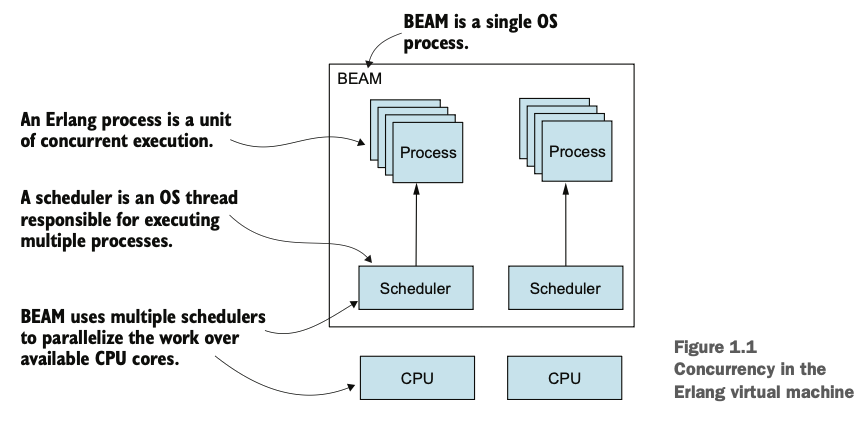
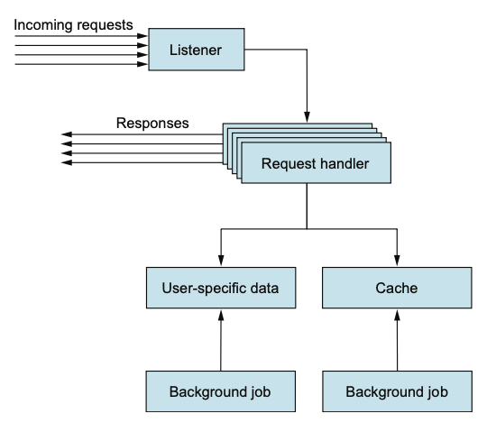

# Chapter 1. First steps

## 📑 목차

1. [Erlang의 동시성 모델](#erlang의-동시성-모델)
2. [서버 사이드 시스템 아키텍처](#서버-사이드-시스템-아키텍처)
3. [Erlang 플랫폼 구성 요소](#erlang-플랫폼-구성-요소)
4. [Open Telecom Platform (OTP)](#open-telecom-platform-otp)
5. [Elixir 매크로와 컴파일 타임 코드 변환](#elixir-매크로와-컴파일-타임-코드-변환)
6. [Erlang 생태계의 한계점](#erlang-생태계의-한계점)
7. [핵심 정리](#핵심-정리)

---

## Erlang의 동시성 모델

* **Erlang 프로세스**:
  Erlang의 기본 동시성 단위로, **운영체제의 프로세스나 스레드와는 별개**로 동작하는 **가벼운 프로세스**임.
* **대규모 확장성**:
  Erlang 시스템은 **수천에서 수백만 개의 프로세스**를 동시에 실행할 수 있음.
* **BEAM (Bogdan/Björn’s Erlang Abstract Machine)**:
  자체 **스케줄러(scheduler)** 를 사용하여 CPU 코어에 프로세스를 분산 실행함으로써 **자동 병렬화**를 수행함.
* **격리성(Isolation)**:
  각 프로세스는 독립적으로 실행되어 **오류 전파가 차단**되고 **안전한 동시성**이 보장됨.

---

## 서버 사이드 시스템 아키텍처

* **단순한 서버 그 이상**:
  서버 사이드 시스템은 요청을 처리할 뿐만 아니라 **백그라운드 작업**, **타이머 관리**, **서버 전체 메모리 상태 관리** 등을 수행해야 함.
* **분산 시스템 구조**:
  보통 여러 대의 머신에 걸쳐 구성되어 **확장성**, **부하 분산(load balancing)**, **장애 복구(failover)** 를 지원함.
* **구성 요소 분리**:
  기능별 컴포넌트를 **서로 다른 서버에 배포하거나 복제**하여 안정성과 성능을 높임.

---

## Erlang 플랫폼 구성 요소

Erlang은 단순한 언어가 아닌 **완전한 개발 플랫폼**으로 구성되어 있음:

1. **언어(Language)** – 함수형 프로그래밍 기반, 메시지 전달 중심의 동시성 지원.
2. **가상머신(Virtual Machine, BEAM)** – Erlang 코드를 **바이트코드로 컴파일하여 실행**함.
3. **프레임워크(OTP)** – **오류 복구**, **배포**, **동시성 패턴** 등을 추상화하여 제공.
4. **도구(Tools)** – **디버깅**, **테스트**, **코드 배포**, **실시간 코드 업데이트** 지원.

---

## Open Telecom Platform (OTP)

* **정의**:
  이름과 달리 “통신 시스템”과 직접적인 관련은 없음.
  **일반적인 서버 애플리케이션 개발을 위한 범용 프레임워크**임.
* **핵심 기능**:

  * **동시성과 분산 처리 패턴** 제공
  * **오류 감지 및 복구 메커니즘**
  * **라이브러리 패키징 및 배포 관리**
  * **무중단 코드 업데이트(Hot Code Upgrade)** 지원
* **의의**:
  개발자는 인프라 세부 구현 대신 **비즈니스 로직**에 집중할 수 있음.

---

## Elixir 매크로와 컴파일 타임 코드 변환

* **매크로(Macro)**:
  **컴파일 시점에 실행되는 코드**로, 소스 코드의 **추상 구문 트리(AST)** 를 입력받아 다른 코드를 생성함.
* **Lisp에서 영감**을 받아, **메타프로그래밍(metaprogramming)** 을 가능하게 함.
* **C 스타일 매크로와의 차이점**:

  * C/C++ 매크로는 **문자열 치환 기반**으로 동작하지만,
  * Elixir 매크로는 **구조화된 코드(AST)** 를 다루므로 **오류 가능성이 적고 강력한 변환이 가능**함.

---

## Erlang 생태계의 한계점

* **속도(Performance)**:

  * Erlang은 **CPU 연산 성능보다 동시성과 안정성에 초점**을 맞춤.
  * 따라서 **CPU 집중 연산 작업(CPU-bound task)** 은 C/C++로 구현한 후 Erlang과 연동하는 것이 효율적임.
* **에코시스템(Ecosystem)**:

  * 타 언어(예: Python, JavaScript)에 비해 **라이브러리의 수가 제한적**임.
  * 동일한 기능을 구현하는 데 **더 많은 시간과 노력이 필요**할 수 있음.

---

## 핵심 정리

* Erlang은 **운영체제 스레드와 독립된 경량 프로세스**로 **대규모 동시성**을 지원한다.
* **서버 사이드 시스템**은 단순 요청 처리뿐 아니라 **백그라운드 작업과 상태 관리**를 포함한다.
* **OTP**는 **오류 복구**, **분산 처리**, **무중단 업데이트**를 지원하는 강력한 프레임워크이다.
* **Elixir 매크로**는 **AST 기반 메타프로그래밍**으로 코드 변환을 수행한다.
* Erlang은 **안정성과 동시성에 강하지만**, **연산 속도와 생태계 측면**에서는 한계가 있다.