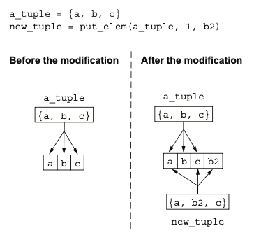
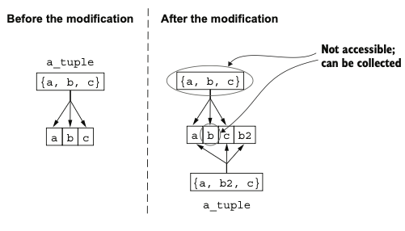
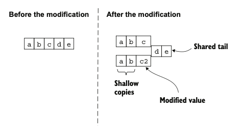
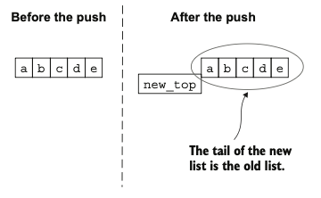

# Chapter 2. Building Blocks 

## 📑 Table of Contents

1. [Variables](#variables)
2. [Modules](#modules)
3. [Functions](#functions)
4. [Function Arity and Defaults](#function-arity-and-defaults)
5. [Function Visibility](#function-visibility)
6. [Import, Alias, Attributes, and Typespecs](#import-alias-attributes-and-typespecs)
7. [Comments and Atoms](#comments-and-atoms)
8. [Tuples and Lists](#tuples-and-lists)
9. [Immutability](#immutability)
10. [Maps](#maps)
11. [Binaries and Bitstrings](#binaries-and-bitstrings)
12. [Strings](#strings)
13. [First-Class Functions](#first-class-functions)
14. [Higher-Level Types](#higher-level-types)
15. [IO Lists](#io-lists)
16. [Operators](#operators)
17. [Macros](#macros)
18. [Modules and Functions at Runtime](#modules-and-functions-at-runtime)
19. [Starting the BEAM Runtime](#starting-the-beam-runtime)
20. [Key Takeaways](#key-takeaways)

---

## Variables

* Elixir is **dynamically typed** — variables don’t need explicit type declarations.
* **Binding** refers to assigning a value to a variable.
* **Rebinding** creates a new memory reference rather than mutating existing data.
* **Garbage collection** automatically frees memory when variables go out of scope.
* Because Elixir is **immutable**, values can’t be changed in place.

---

## Modules

* A **module** is a logical grouping of functions (like a namespace).
* Defined using `defmodule`:

  ```elixir
  defmodule Geometry do
    def rectangle_area(a, b), do: a * b
  end
  ```
* Module names start with an uppercase letter and use CamelCase.
* Dots (`.`) are used for hierarchical organization, e.g., `MyApp.Math.Geometry`.

---

## Functions

* Every function **must belong to a module**.
* Function names start with a lowercase letter or underscore.
* Naming conventions:

  * `?` → indicates a boolean-returning function (`empty?`)
  * `!` → indicates a function that may raise an error (`save!`)
* The **pipe operator** (`|>`) passes results from one function to the next:

  ```elixir
  -5 |> abs() |> Integer.to_string() |> IO.puts()
  ```

---

## Function Arity and Defaults

* **Arity** = number of function arguments.
  Example: `Rectangle.area/2` means the function `area` takes 2 arguments.
* Functions with the same name but different arities are distinct:

  ```elixir
  def area(a), do: area(a, a)
  def area(a, b), do: a * b
  ```
* Use `\\` to define **default argument values**:

  ```elixir
  def add(a, b \\ 0), do: a + b
  ```

---

## Function Visibility

* **Public functions**: defined with `def`.
* **Private functions**: defined with `defp`, callable only inside the same module.

  ```elixir
  defmodule Example do
    def double(a), do: sum(a, a)
    defp sum(a, b), do: a + b
  end
  ```

---

## Import, Alias, Attributes, and Typespecs

* **import**: allows using another module’s functions directly.

  ```elixir
  import IO
  puts "Hello!"
  ```
* **alias**: provides a shorthand for long module names.

  ```elixir
  alias IO, as: MyIO
  MyIO.puts("Hi")
  ```
* **module attributes**: constants or metadata stored with `@`.

  ```elixir
  @pi 3.14159
  def area(r), do: r * r * @pi
  ```
* **typespecs**: provide type information for static analysis (`@spec`).

  ```elixir
  @spec area(number) :: number
  ```

---

## Comments and Atoms

* **Comments** begin with `#`.
* **Atoms** are named constants, similar to symbols in Ruby:

  ```elixir
  :ok
  :error
  ```
* Boolean values are actually atoms (`:true`, `:false`).
* `nil` is an atom equivalent to `:nil`.

---

## Tuples and Lists

* **Tuples** store a fixed number of elements.

  ```elixir
  person = {"Bob", 25}
  elem(person, 1) # 25
  ```
* **Lists** are linked structures for variable-sized collections:

  ```elixir
  primes = [2, 3, 5, 7]
  ```
* Access is O(n); best used for sequential processing.
* Use `++` to concatenate lists.
* Adding elements to the **head** is O(1); appending to the **tail** is O(n).

---

## Immutability

* All data is **immutable** — changes return new versions.
* Memory is often **shared** between old and new versions (structural sharing).
* Benefits:

  * Side-effect-free, predictable functions
  * Consistent and thread-safe data
* Example pipeline:

  ```elixir
  data
  |> transform1()
  |> transform2()
  |> transform3()
  ```






---

## Maps

* Key–value data structure where keys and values can be any type:

  ```elixir
  bob = %{name: "Bob", age: 25}
  bob.age # 25
  ```
* Update existing keys:

  ```elixir
  %{bob | age: 26}
  ```
* Adding or updating fields creates new maps — no mutation.

---

## Binaries and Bitstrings

* Represent raw data with `<< >>`:

  ```elixir
  <<1, 2, 3>>
  <<257::16>> # <<1, 1>>
  ```
* Concatenate binaries with `<>`:

  ```elixir
  <<1, 2>> <> <<3, 4>> # <<1, 2, 3, 4>>
  ```
* If total bit size isn’t a multiple of 8, the result is a **bitstring**.

---

## Strings

* Strings are **binaries under the hood**.
* Basic string:

  ```elixir
  "Hello"
  ```
* **Interpolation**:

  ```elixir
  "Result: #{3 + 0.14}"
  ```
* **Sigils**:

  * `~s(...)` → allows embedded quotes
  * `~S(...)` → no interpolation or escaping
* **Heredocs** for multiline strings:

  ```elixir
  """
  This is a
  multiline string.
  """
  ```
* **Character lists (charlists)**: lists of integer code points (`~c"ABC"`).
  Prefer **binary strings** for most use cases.

---

## First-Class Functions

* Functions can be **stored in variables** and **passed as arguments**:

  ```elixir
  square = fn x -> x * x end
  square.(5)
  ```
* **Anonymous functions** use `fn -> ... end`.
* **Capture operator (`&`)** creates concise lambdas:

  ```elixir
  &IO.puts/1
  &(&1 * &2 + &3)
  ```
* Functions form **closures**, capturing outer variables by reference.

---

## Higher-Level Types

* **Ranges**:

  ```elixir
  range = 1..3
  2 in range # true
  ```
* **Keyword lists**: lists of key–value tuples using atom keys.

  ```elixir
  [monday: 1, tuesday: 2]
  ```
* **MapSets**: sets of unique values.

  ```elixir
  days = MapSet.new([:monday, :tuesday])
  ```
* **Dates and Times**:

  ```elixir
  ~D[2025-10-19]
  ~T[11:59:12]
  ~U[2025-10-19 11:59:12Z]
  ```

---

## IO Lists

* Nested lists of bytes and binaries used for **efficient I/O building**:

  ```elixir
  iolist = [["He", "llo"], " world!"]
  IO.puts(iolist)
  ```
* Appending is **O(1)** because nesting is used instead of copying.

---

## Operators

* **Comparison**:

  * `===`, `!==`: strict equality
  * `==`, `!=`: loose equality
  * `<`, `>`, `<=`, `>=`: standard ordering
* **Logical / Short-circuiting**:

  * `&&`, `||`, `!` follow **truthiness rules** (`nil` and `false` are falsy).

---

## Macros

* Macros are **compile-time code transformers**.
* Example: `unless` is a macro that converts into an inverted `if`:

  ```elixir
  unless expr do
    block1
  else
    block2
  end
  ```

  becomes:

  ```elixir
  if expr do
    block2
  else
    block1
  end
  ```
* Many Elixir constructs (`if`, `def`, `defmodule`) are macros built on a small core language.

---

## Modules and Functions at Runtime

* The **BEAM VM** runs as a single OS process managing all modules.
* Modules are loaded dynamically from `.beam` files as needed.
* **Dynamic function calls**:

  ```elixir
  apply(IO, :puts, ["Hello dynamically!"])
  ```

---

## Starting the BEAM Runtime

1. **Interactive shell (`iex`)**

   * Runs interpreted code for experimentation.

2. **Running scripts**

   ```bash
   $ elixir script.exs
   ```

   * Compiles in-memory, runs, then halts.
   * `--no-halt` keeps BEAM alive for concurrent tasks.

3. **Using Mix (Project Tool)**

   ```bash
   $ mix new my_project
   $ mix compile
   $ mix run -e "IO.puts(MyProject.hello())"
   $ mix test
   ```

   * Mix manages compilation, dependencies, and testing.

---

## Key Takeaways

* Elixir’s **immutability and functional style** enable reliable, concurrent programming.
* Functions are identified by **module + name + arity**.
* **Pipe operator (`|>`)** improves function composition and readability.
* **Maps** are flexible key–value stores, while **lists** handle dynamic sequences.
* **Macros** are the foundation of Elixir’s **metaprogramming** power.
* The **BEAM VM** orchestrates everything — lightweight processes, fault tolerance, and module loading.
* **Mix** provides a complete toolchain for building, testing, and deploying Elixir systems.
