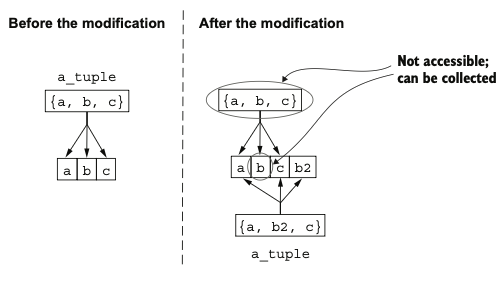
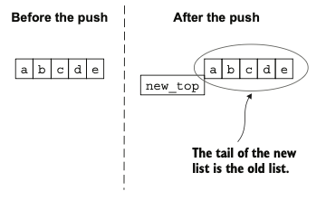

# Chapter 2. Building Blocks

## 📑 목차

1. [변수 (Variables)](#변수-variables)
2. [모듈 (Modules)](#모듈-modules)
3. [함수 (Functions)](#함수-functions)
4. [함수 시그니처와 기본값 (Function Arity & Defaults)](#함수-시그니처와-기본값-function-arity--defaults)
5. [함수 가시성 (Visibility)](#함수-가시성-visibility)
6. [Import, Alias, Attribute, Typespec](#import-alias-attribute-typespec)
7. [주석과 원자 (Comments & Atoms)](#주석과-원자-comments--atoms)
8. [튜플과 리스트 (Tuples & Lists)](#튜플과-리스트-tuples--lists)
9. [불변성 (Immutability)](#불변성-immutability)
10. [맵 (Maps)](#맵-maps)
11. [이진수/비트스트링 (Binaries & Bitstrings)](#이진수비트스트링-binaries--bitstrings)
12. [문자열 (Strings)](#문자열-strings)
13. [일급 함수 (First-class Functions)](#일급-함수-first-class-functions)
14. [고급 타입들 (Ranges, Keyword Lists, MapSets, Dates)](#고급-타입들-ranges-keyword-lists-mapsets-dates)
15. [IO 리스트 (IO Lists)](#io-리스트-io-lists)
16. [연산자 (Operators)](#연산자-operators)
17. [매크로 (Macros)](#매크로-macros)
18. [런타임에서의 모듈과 함수](#런타임에서의-모듈과-함수)
19. [BEAM 런타임 시작 방식](#beam-런타임-시작-방식)
20. [핵심 정리](#핵심-정리)

---

## 변수 (Variables)

* **동적 타이핑(Dynamic typing)**: 타입 선언 없이 값에 따라 결정.
* **바인딩(Binding)**: 변수 할당을 의미.
* **재바인딩(Rebinding)**: 기존 값을 변경하지 않고 **새 메모리 위치에 새 값 저장**.
* **가비지 컬렉션(GC)**: 사용이 끝난 변수는 자동으로 메모리 해제.
* Elixir는 **불변(immutable)** 언어이므로 데이터는 직접 변경되지 않음.

---

## 모듈 (Modules)

* 함수들의 **논리적 묶음(namespace)**.
* 정의 방법:

  ```elixir
  defmodule Geometry do
    def rectangle_area(a, b), do: a * b
  end
  ```
* **대문자 시작**, CamelCase 사용.
* `.`으로 계층적 이름 구조 가능 (`MyApp.Math.Geometry` 등).

---

## 함수 (Functions)

* 모든 함수는 **모듈 내에서 정의**.
* 함수 이름은 **소문자 또는 `_`** 로 시작.
* **?** → boolean 반환 함수, **!** → 예외 발생 가능 함수.
* 파이프 연산자 `|>` 로 함수 체인:

  ```elixir
  -5 |> abs() |> Integer.to_string() |> IO.puts()
  ```

---

## 함수 시그니처와 기본값 (Function Arity & Defaults)

* **Arity(아리티)** = 인자 개수.

  * 예: `Rectangle.area/2` → 인자 2개.
* 같은 이름이라도 arity가 다르면 **별개 함수**.
* 기본값(`\\`)으로 **다중 함수 자동 생성**:

  ```elixir
  def add(a, b \\ 0), do: a + b
  ```

---

## 함수 가시성 (Visibility)

* `def` → 공개 함수 (외부 호출 가능)
* `defp` → 비공개 함수 (모듈 내부 전용)

  ```elixir
  defp sum(a, b), do: a + b
  ```

---

## Import, Alias, Attribute, Typespec

* **import**: 다른 모듈 함수 직접 사용 가능.

  ```elixir
  import IO
  puts "Hello!"
  ```
* **alias**: 긴 이름 단축.

  ```elixir
  alias IO, as: MyIO
  MyIO.puts("Hi")
  ```
* **module attribute (@)**: 상수/메타데이터.

  ```elixir
  @pi 3.14
  def area(r), do: r*r*@pi
  ```
* **typespec** (`@spec`): 정적 분석용 타입 정의.

  ```elixir
  @spec area(number) :: number
  ```

---

## 주석과 원자 (Comments & Atoms)

* **주석**: `#` 로 시작.
* **원자(atom)**: 이름 있는 상수 (`:ok`, `:error`, `:nil`).
* Boolean도 실제로는 원자(`:true`, `:false`).
* **alias**는 내부적으로 `"Elixir."` prefix를 붙인 원자임.

---

## 튜플과 리스트 (Tuples & Lists)

* **튜플(tuple)**: 고정 크기, 빠른 접근.

  ```elixir
  person = {"Bob", 25}
  elem(person, 1) # 25
  ```
* **리스트(list)**: 가변 크기, 연결 리스트 구조.

  ```elixir
  primes = [2,3,5,7]
  length(primes) # O(n)
  ```
* 리스트는 **맨 앞 추가(push)** 가 가장 효율적.

---

## 불변성 (Immutability)

* 데이터는 **절대 수정되지 않음**.
* 새로운 버전을 생성하고, 필요 시 **공유(sharing)** 메모리 구조를 사용.
* 장점:

  * **사이드 이펙트 없음**
  * **데이터 일관성 보장**
* 함수 체이닝 예시:

  ```elixir
  data
  |> transform1()
  |> transform2()
  |> transform3()
  ```






---

## 맵 (Maps)

* **키-값 구조**, 키와 값은 어떤 타입도 가능.

  ```elixir
  bob = %{name: "Bob", age: 25}
  bob.age # 25
  ```
* 수정:

  ```elixir
  %{bob | age: 26}
  ```
* 존재하지 않는 키 수정 시 오류 발생.

---

## 이진수/비트스트링 (Binaries & Bitstrings)

* **이진 데이터 구조**: `<< >>` 사용.

  ```elixir
  <<1,2,3>>
  <<257::16>> # <<1,1>>
  ```
* **비트 단위 조작 가능** (`::size(n)` 지정).
* **연결**: `<>` 연산자 사용.

---

## 문자열 (Strings)

* 문자열은 **이진(binary)** 기반.
* 표현 방식:

  * `"..."` → 기본 문자열
  * `~s(...)` / `~S(...)` → Sigil 문자열
  * `"""..."""` → 여러 줄 문자열(Heredoc)
* **문자 리스트(Charlists)**: `[65, 66, 67]` ≡ `~c"ABC"`
* 문자열과 charlist는 **서로 호환되지 않음**.

---

## 일급 함수 (First-class Functions)

* 함수는 **값으로 취급** 가능:

  ```elixir
  square = fn x -> x * x end
  square.(5)
  ```
* **익명 함수(λ)** 와 **클로저(Closure)** 지원.
* **캡처 연산자(&)**:

  ```elixir
  Enum.each([1,2,3], &IO.puts/1)
  lambda = &(&1 * &2 + &3)
  ```

---

## 고급 타입들 (Ranges, Keyword Lists, MapSets, Dates)

* **Range**: `1..10`
* **Keyword list**: `[key: value]`, 순서 유지, 중복 허용.
* **MapSet**: 중복 없는 집합 구조.
* **Date/Time**:

  ```elixir
  ~D[2025-10-19]
  ~T[11:59:12]
  ~U[2025-10-19 11:59:12Z]
  ```

---

## IO 리스트 (IO Lists)

* **바이트 또는 이진 데이터의 중첩 리스트**.
* 효율적 스트림 출력 가능 (O(1) append).

  ```elixir
  iolist = [["He", "llo"], " world!"]
  IO.puts(iolist)
  ```

---

## 연산자 (Operators)

* **비교 연산자**

  * `===`, `!==` → 엄격 비교
  * `==`, `!=` → 느슨한 비교 (정수 vs 실수 구분)
* **논리 연산자**

  * `&&`, `||`, `!` → truthy/falsy 평가 (nil, false만 falsy)

---

## 매크로 (Macros)

* **컴파일 타임에 코드 변환 수행**.
* `unless` 예:

  ```elixir
  unless x do
    ...
  end
  ```

  → 컴파일 시 `if` 문으로 변환됨.
* Elixir 핵심 구문(`if`, `def`, `defmodule`)도 모두 **매크로 기반**.

---

## 런타임에서의 모듈과 함수

* **모든 코드**는 **BEAM 프로세스 내부**에서 실행됨.
* 모듈은 **메모리에 로드되거나 디스크에서 .beam 파일로 불러옴**.
* 동적 함수 호출:

  ```elixir
  apply(IO, :puts, ["Hello"])
  ```

---

## BEAM 런타임 시작 방식

1. **대화형 쉘 (iex)** — 인터프리터 기반.
2. **스크립트 실행 (elixir file.exs)** — 단일 파일 실행.

   * `--no-halt` 옵션으로 BEAM 지속 실행 가능.
3. **Mix 툴** — 프로젝트 생성 및 관리.

   ```bash
   $ mix new my_project
   $ mix compile
   $ mix run -e "IO.puts(MyProject.hello())"
   $ mix test
   ```

---

## 🧠 핵심 정리

* Elixir는 **함수형, 불변성, 동시성** 중심의 언어다.
* **모든 함수는 모듈 내부**에 정의되며, **arity(인자 개수)** 로 구분된다.
* **파이프 연산자**는 함수 체이닝을 단순화한다.
* **데이터는 불변**이며, 수정 시 **새 메모리 위치로 재바인딩**된다.
* **Map, List, Tuple** 각각의 사용 목적을 구분해야 한다.
* **매크로**는 Elixir의 **언어 확장성과 메타프로그래밍의 핵심**이다.
* **BEAM**은 모든 코드를 관리하며, **Mix**는 프로젝트 수준의 자동화 도구이다.

