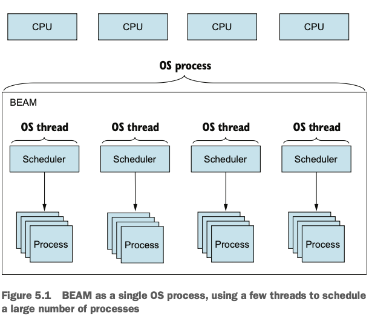
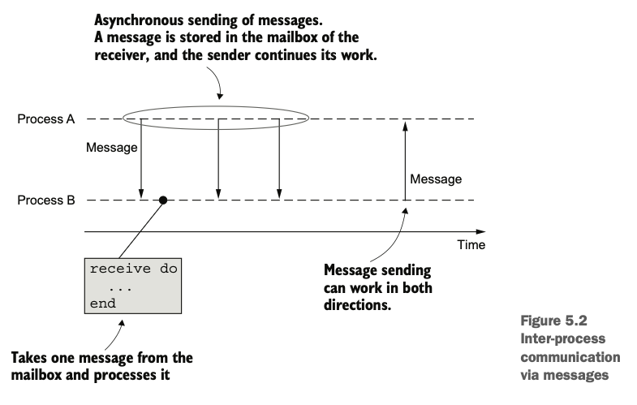
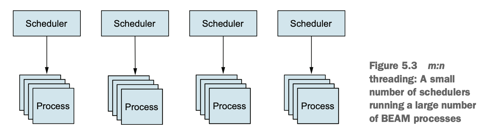

# Chapter 5. Concurrency Primitives

## Table of Contents

- [Chapter 5. Concurrency Primitives](#chapter-5-concurrency-primitives)
  - [Table of Contents](#table-of-contents)
  - [Concurrency in BEAM](#concurrency-in-beam)
  - [Working with Processes](#working-with-processes)
    - [Creating Processes](#creating-processes)
    - [Message Passing](#message-passing)
  - [Stateful Server Processes](#stateful-server-processes)
    - [Server Basics](#server-basics)
    - [Sequential Execution](#sequential-execution)
    - [Maintaining Process State](#maintaining-process-state)
    - [Mutable State and Stateful Calculators](#mutable-state-and-stateful-calculators)
    - [Refactoring the Server Loop](#refactoring-the-server-loop)
    - [Complex States with TodoServer](#complex-states-with-todoserver)
    - [Registered Processes](#registered-processes)
  - [Runtime Considerations](#runtime-considerations)
    - [A Process Is Sequential](#a-process-is-sequential)
    - [Unlimited Process Mailboxes](#unlimited-process-mailboxes)
    - [Shared-nothing Concurrency](#shared-nothing-concurrency)
    - [Scheduler Inner Workings](#scheduler-inner-workings)
  - [Key Takeaways](#key-takeaways)

---

## Concurrency in BEAM



* **Erlang/Elixir’s goal** is building *highly available systems* that remain responsive and recover gracefully.
* Key challenges:

  * **Fault tolerance** → isolate and recover from crashes.
  * **Scalability** → handle increased load without code changes.
  * **Distribution** → run across multiple nodes for redundancy.
* **BEAM process** is the basic concurrency unit — lightweight, isolated, and fast.
* Each **scheduler thread** in BEAM manages a set of processes.

  * Default: number of schedulers = number of CPU cores.
  * Example: 4 schedulers on a quad-core CPU.
* Process creation: a few microseconds and ~2 KB memory footprint (vs MBs for OS threads).
* Processes are **fully isolated** — no shared memory, no crash propagation.

---

## Working with Processes

### Creating Processes

* Processes are created using `spawn/1`:

  ```elixir
  spawn(fn ->
    IO.puts("Hello from another process")
  end)
  ```
* Returns a **PID** (`#PID<0.x.0>`) — identifier of the new process.
* Processes run concurrently; caller continues immediately.

**Example: concurrent queries**

```elixir
run_query = fn query ->
  Process.sleep(2000)
  "#{query} result"
end

Enum.each(1..5, fn i ->
  spawn(fn -> IO.puts(run_query.("query #{i}")) end)
end)
```

➡ Each query runs concurrently — results print after ~2 seconds total instead of 10.

---

### Message Passing



* Processes **communicate via messages**, not shared memory.
* `send(pid, message)` places a message in the receiver’s **mailbox**.
* `receive` extracts messages:

  ```elixir
  receive do
    {:msg, content} -> IO.puts(content)
  after
    5000 -> IO.puts("timeout")
  end
  ```

**Rules:**

1. Mailbox = FIFO queue.
2. Messages are deep-copied.
3. Unmatched messages remain in mailbox.

**Synchronous messaging pattern**

```elixir
# Caller
send(pid, {self(), :ping})
receive do {:pong, msg} -> msg end

# Receiver
receive do
  {caller, :ping} -> send(caller, {:pong, "ok"})
end
```

---

## Stateful Server Processes

### Server Basics

A **server process**:

* Runs indefinitely using **tail recursion**.
* Waits for messages and reacts to them.
* Keeps internal **state** between messages.

**Example: Database server**

```elixir
defmodule DatabaseServer do
  def start, do: spawn(&loop/0)

  defp loop do
    receive do
      {:run_query, caller, query} ->
        result = run_query(query)
        send(caller, {:query_result, result})
    end
    loop()
  end
end
```

**Interface abstraction:**

```elixir
def run_async(pid, query), do: send(pid, {:run_query, self(), query})
def get_result do
  receive do
    {:query_result, result} -> result
  after
    5000 -> {:error, :timeout}
  end
end
```

---

### Sequential Execution

* A single process handles **one message at a time** → internally sequential.
* Prevents race conditions but can become a bottleneck.

**Parallelization approach**

```elixir
pool = Enum.map(1..100, fn _ -> DatabaseServer.start() end)
server = Enum.at(pool, :rand.uniform(100) - 1)
DatabaseServer.run_async(server, "query")
```

---

### Maintaining Process State

Each process can hold its own **state**:

```elixir
def start do
  spawn(fn ->
    connection = :rand.uniform(1000)
    loop(connection)
  end)
end
```

The state (`connection`) is passed recursively:

```elixir
defp loop(connection) do
  receive do
    {:run_query, from, query} ->
      result = run_query(connection, query)
      send(from, {:query_result, result})
  end
  loop(connection)
end
```

---

### Mutable State and Stateful Calculators

Processes emulate mutability by returning a **new state** on each loop:

```elixir
defp loop(state) do
  new_state =
    receive do
      {:add, x} -> state + x
      {:sub, x} -> state - x
      {:value, caller} -> send(caller, {:response, state}); state
    end
  loop(new_state)
end
```

**Interface functions**

```elixir
def start, do: spawn(fn -> loop(0) end)
def add(pid, val), do: send(pid, {:add, val})
def value(pid) do
  send(pid, {:value, self()})
  receive do {:response, v} -> v end
end
```

---

### Refactoring the Server Loop

Use **pattern-matching functions** for cleaner design:

```elixir
defp loop(state) do
  receive do
    msg -> loop(process_message(state, msg))
  end
end

defp process_message(state, {:add, x}), do: state + x
defp process_message(state, {:value, caller}) do
  send(caller, {:response, state}); state
end
```

---

### Complex States with TodoServer

**Combining stateful process + functional abstraction**

```elixir
defmodule TodoServer do
  def start, do: spawn(fn -> loop(TodoList.new()) end)

  def add_entry(pid, entry),
    do: send(pid, {:add_entry, entry})

  def entries(pid, date) do
    send(pid, {:entries, self(), date})
    receive do {:todo_entries, e} -> e end
  end

  defp loop(todo_list) do
    receive do
      {:add_entry, e} -> loop(TodoList.add_entry(todo_list, e))
      {:entries, caller, d} ->
        send(caller, {:todo_entries, TodoList.entries(todo_list, d)})
        loop(todo_list)
    end
  end
end
```

➡ Separation of concerns:

* `TodoList` → pure data structure
* `TodoServer` → concurrent process wrapper

---

### Registered Processes

Use **named processes** to avoid passing PIDs:

```elixir
def start do
  spawn(fn ->
    Process.register(self(), :todo_server)
    loop(TodoList.new())
  end)
end

def add_entry(entry),
  do: send(:todo_server, {:add_entry, entry})
```

* Name must be an **atom**.
* Each process can have only one name.
* Names are **local to a BEAM instance**.

---

## Runtime Considerations

### A Process Is Sequential

* Each process executes one message at a time.
* A slow process = system bottleneck.

**Optimization approaches:**

1. Make handlers faster.
2. Use multiple worker processes.

---

### Unlimited Process Mailboxes

* Mailboxes grow with incoming messages.
* Unhandled or unmatched messages accumulate indefinitely.
* Always include a **catch-all clause**:

  ```elixir
  receive do
    {:msg, m} -> handle(m)
    other -> IO.puts("Unknown message: #{inspect other}")
  end
  ```

---

### Shared-nothing Concurrency

* Each process has **its own heap** — no shared memory.
* Every message or closure variable is **deep-copied**.
* Pros:

  * Strong isolation.
  * Per-process garbage collection.
  * No global “stop-the-world” GC.

---

### Scheduler Inner Workings



* BEAM uses **m:n scheduling** (many processes on few OS threads).
* Each scheduler handles a few thousand function calls per process before switching.
* `+S n` flag sets number of schedulers:

  ```bash
  iex --erl "+S 1"
  ```
* Even with 1 scheduler, the system stays responsive due to **frequent preemption**.

---

## Key Takeaways

* **Processes** are the atomic concurrency units in BEAM.
* They are **lightweight**, **isolated**, and managed by BEAM schedulers.
* Communication uses **message passing**, not shared memory.
* **Stateful processes** maintain their own mutable-like state safely.
* **Sequential inside, concurrent outside** — design for scalability.
* Avoid unhandled messages and large mailboxes.
* BEAM’s **scheduler and GC model** ensure responsiveness even under heavy load.
