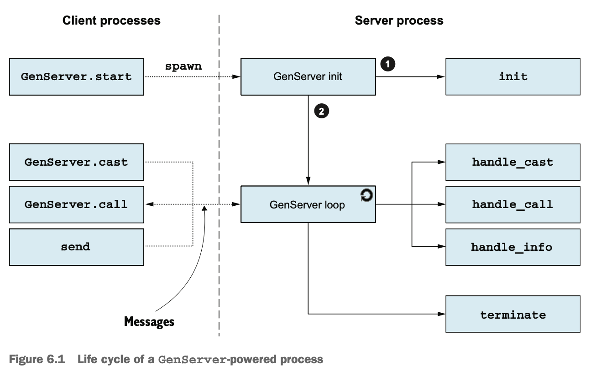

# 6장. 일반 서버 프로세스 (Generic Server Processes)

- [6장. 일반 서버 프로세스 (Generic Server Processes)](#6장-일반-서버-프로세스-generic-server-processes)
  - [1. OTP 프레임워크 소개](#1-otp-프레임워크-소개)
  - [2. 일반 서버 프로세스 구현](#2-일반-서버-프로세스-구현)
    - [모듈 기반 플러그인 구조](#모듈-기반-플러그인-구조)
    - [제네릭 코드 구현](#제네릭-코드-구현)
    - [추상화 활용](#추상화-활용)
    - [비동기 요청 지원](#비동기-요청-지원)
  - [3. GenServer 사용하기](#3-genserver-사용하기)
    - [OTP 비헤이비어(behaviour)](#otp-비헤이비어behaviour)
    - [GenServer 연결하기](#genserver-연결하기)
    - [요청 처리 방식](#요청-처리-방식)
    - [일반 메시지 처리](#일반-메시지-처리)
    - [기타 주요 기능](#기타-주요-기능)
      - [컴파일 시점 검증](#컴파일-시점-검증)
      - [이름 등록](#이름-등록)
      - [서버 종료](#서버-종료)
    - [프로세스 생명주기](#프로세스-생명주기)
    - [OTP 규격 프로세스](#otp-규격-프로세스)
  - [핵심 요약](#핵심-요약)


## 1. OTP 프레임워크 소개

* **OTP (Open Telecom Platform)** 은 이름과 달리 통신만을 위한 것이 아니라, **안정적이고 확장 가능한 시스템을 구축하기 위한 패턴과 추상화**를 제공하는 프레임워크.
* 주요 기능: **에러 복구, 로그 관리, 이벤트 처리, 코드 업그레이드, 프로세스 감독(supervision)** 등.
* 핵심 개념은 **서버 프로세스(server process)** 로, 메시지를 처리하고 상태(state)를 유지하는 독립적인 실행 단위.

---

## 2. 일반 서버 프로세스 구현

### 모듈 기반 플러그인 구조

* 여러 서버 구현 간 공통되는 부분(스폰, 루프, 메시지 처리, 응답 전송)을 **하나의 제네릭 코드로 추상화**할 수 있음.
* 개별 구현은 **콜백 모듈(callback module)** 을 통해 구체적인 동작만 정의.
* 모듈 이름(atom)을 변수로 저장하고, 이를 통해 **동적 함수 호출** 가능:

  ```elixir
  some_module = IO
  some_module.puts("Hello")
  ```

### 제네릭 코드 구현

* `ServerProcess.start/1`은 **새 프로세스를 스폰(spawn)** 하고, 콜백 모듈의 `init/0`을 호출해 초기 상태를 생성.
* 루프(`loop/2`)에서 메시지를 받아 처리하고, 상태를 갱신:

  ```elixir
  receive do
    {request, caller} ->
      {response, new_state} = callback_module.handle_call(request, current_state)
      send(caller, {:response, response})
      loop(callback_module, new_state)
  end
  ```
* **제네릭 코드**는 메시지 송수신을 담당하고, **콜백 모듈**은 구체적 처리 로직만 구현.

### 추상화 활용

* 예시: `KeyValueStore`

  * `init/0`과 `handle_call/2`를 구현해 키-값 저장소 동작을 정의.
  * 클라이언트는 `start/0`, `put/3`, `get/2` 인터페이스 함수를 통해 간단히 접근.
* 이러한 **인터페이스 함수(interface functions)** 는 클라이언트용 API 역할을 하며, 내부 동작(ServerProcess)은 감춰짐.

### 비동기 요청 지원

* 요청을 두 종류로 구분:

  * **call**: 동기(synchronous) — 응답을 기다림
  * **cast**: 비동기(asynchronous) — 응답을 기다리지 않음
* 메시지 형식:

  ```elixir
  {:call, request, caller}
  {:cast, request}
  ```
* `handle_cast/2`는 응답 없이 상태만 갱신하는 콜백.
* 예: `KeyValueStore.put`은 `cast`, `get`은 `call`로 구현.

---

## 3. GenServer 사용하기

### OTP 비헤이비어(behaviour)

* **비헤이비어(behaviour)** 는 공통 패턴을 일반화한 모듈.
* 개발자는 해당 비헤이비어가 요구하는 **콜백 함수 세트**를 구현해야 함.
* 주요 OTP 비헤이비어:

  * `gen_server` — 상태 기반 서버
  * `application` — 애플리케이션 컴포넌트
  * `gen_event` — 이벤트 핸들링
  * `gen_statem` — 상태 머신
* Elixir는 이를 편리하게 사용하도록 **GenServer, Supervisor, Application** 모듈을 제공.

### GenServer 연결하기

* `use GenServer`를 사용하면 기본 콜백 함수들이 자동으로 주입됨.

  ```elixir
  defmodule KeyValueStore do
    use GenServer
  end
  ```
* `GenServer.start/2`로 서버를 시작:

  ```elixir
  GenServer.start(KeyValueStore, nil)
  # {:ok, #PID<0.51.0>}
  ```

### 요청 처리 방식

* 필요한 콜백:

  ```elixir
  def init(_), do: {:ok, %{}}
  def handle_cast({:put, key, value}, state), do: {:noreply, Map.put(state, key, value)}
  def handle_call({:get, key}, _from, state), do: {:reply, Map.get(state, key), state}
  ```
* 인터페이스 함수:

  ```elixir
  def start, do: GenServer.start(KeyValueStore, nil)
  def put(pid, k, v), do: GenServer.cast(pid, {:put, k, v})
  def get(pid, k), do: GenServer.call(pid, {:get, k})
  ```
* 특징:

  * `GenServer.start/2`는 `init/1` 완료 후 반환됨.
  * `GenServer.call/2`는 기본 **5초 타임아웃**.
  * 서버 종료 시 클라이언트에도 에러 전파.

### 일반 메시지 처리

* `GenServer`는 내부적으로 `:$gen_call`, `:$gen_cast` 형태의 메시지를 처리.
* 일반 메시지는 `handle_info/2`에서 처리:

  ```elixir
  def handle_info(:cleanup, state) do
    IO.puts("cleanup 실행 중...")
    {:noreply, state}
  end
  ```
* 예: `:timer.send_interval(5000, :cleanup)`을 사용해 주기적 메시지 전송.

---

### 기타 주요 기능

#### 컴파일 시점 검증

* 콜백 함수 정의 시 `@impl GenServer`를 명시하면 시그니처 오류를 조기에 발견 가능:

  ```elixir
  @impl GenServer
  def handle_call(req, from, state), do: {:reply, req, state}
  ```

#### 이름 등록

* 프로세스를 **로컬 이름(atom)** 으로 등록 가능:

  ```elixir
  GenServer.start(KeyValueStore, nil, name: :KeyValueStore)
  GenServer.call(:KeyValueStore, {:get, :key})
  ```
* `__MODULE__`을 사용하면 리팩터링 시에도 안전:

  ```elixir
  GenServer.start(__MODULE__, nil, name: __MODULE__)
  ```

#### 서버 종료

* 콜백 반환값에 따라 동작:

  * `{:ok, state}` → 정상 시작
  * `{:stop, reason}` → 오류로 시작 중단
  * `:ignore` → 정상적인 무시
* `handle_*` 콜백에서:

  * `{:stop, reason, state}` 또는 `{:stop, reason, reply, state}` 가능
* `terminate/2`는 종료 직전 호출되어 정리(cleanup)에 사용됨.
* 클라이언트는 `GenServer.stop/3`로 서버를 종료시킬 수 있음.

---

### 프로세스 생명주기



* 클라이언트가 `GenServer.start` 호출 → 서버 프로세스 생성.
* 서버 내부에서 `init/1`로 초기 상태 설정.
* 이후 `GenServer.call/cast` 요청 → 서버 루프에서 수신 및 콜백 호출.
* 콜백은 항상 **서버 프로세스 내에서 실행**, 상태는 콜백을 통해 계속 갱신됨.

---

### OTP 규격 프로세스

* **spawn** 으로 시작한 일반 프로세스는 생산 환경에서 권장되지 않음.
* **OTP 규격(OTP-compliant)** 프로세스는 감독, 로깅, 복구 기능과 통합 가능.
* 주요 모듈:

  * `GenServer` — 일반 서버 프로세스
  * `Supervisor` — 오류 복구를 위한 감독자
  * `Task` — 단발성 비동기 작업
  * `Agent` — 단순 상태 관리용

---

## 핵심 요약

* **ServerProcess → GenServer**: 콜백 기반 구조를 표준화한 OTP 서버.
* **call**은 동기식, **cast**는 비동기식 요청 처리 방식.
* 모든 상태(state)는 서버 내부 루프에서 유지되고 콜백으로 변경됨.
* `@impl` 사용으로 콜백 시그니처 오류를 예방.
* 이름 등록을 통해 PID 없이 접근 가능.
* `handle_info/2`로 일반 메시지 처리 및 주기적 작업 수행 가능.
* OTP 규격 프로세스는 신뢰성 높은 시스템 구축의 기본 단위.