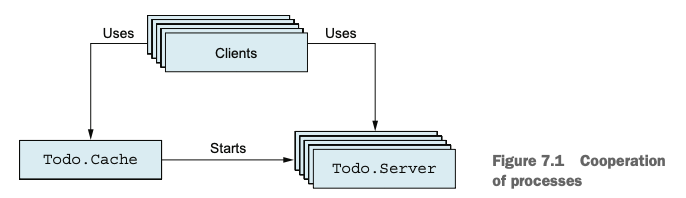
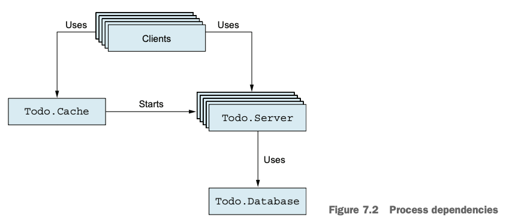
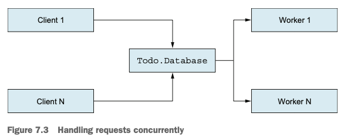
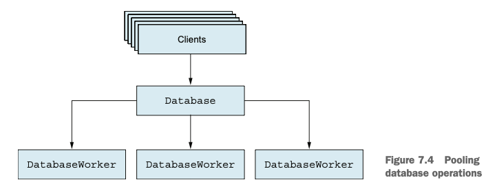

# Chapter 7. 엘릭서로 동시성 시스템 구축하기

- [Chapter 7. 엘릭서로 동시성 시스템 구축하기](#chapter-7-엘릭서로-동시성-시스템-구축하기)
  - [1. Mix 프로젝트 다루기](#1-mix-프로젝트-다루기)
  - [2. 다중 To-Do 리스트 관리](#2-다중-to-do-리스트-관리)
  - [3. 캐시 구현하기](#3-캐시-구현하기)
  - [4. 테스트 작성하기](#4-테스트-작성하기)
  - [5. 프로세스 의존성 분석](#5-프로세스-의존성-분석)
  - [6. 데이터 영속화](#6-데이터-영속화)
    - [인코딩과 저장](#인코딩과-저장)
    - [시스템에 통합하기](#시스템에-통합하기)
  - [7. 프로세스 병목 해결하기](#7-프로세스-병목-해결하기)
    - [1️⃣ 프로세스 생략 (직접 실행)](#1️⃣-프로세스-생략-직접-실행)
    - [2️⃣ 요청 병렬 처리](#2️⃣-요청-병렬-처리)
    - [3️⃣ 풀링(Pooling)으로 동시성 제한](#3️⃣-풀링pooling으로-동시성-제한)
  - [8. 프로세스로 사고하기](#8-프로세스로-사고하기)
  - [🧩 핵심 요약](#-핵심-요약)

---

## 1. Mix 프로젝트 다루기

* **Mix**는 엘릭서의 프로젝트 관리 도구이다.

  * 새 프로젝트 생성: `$ mix new todo`
  * 컴파일: `mix compile`, 테스트 실행: `mix test`
  * 셸 실행: `iex -S mix` (컴파일 후 자동으로 모듈 로드)
* **파일/모듈 규칙**

  * 하나의 파일에는 하나의 모듈만.
  * 모듈명은 **공통 접두사(alias)**를 가지도록 한다. (`Todo.Server`, `Todo.List` 등)
  * 파일명은 **snake_case**로 작성하며, 디렉토리 구조는 모듈 경로와 일치해야 한다.
    예: `Todo.Server` → `lib/todo/server.ex`

---

## 2. 다중 To-Do 리스트 관리

* 두 가지 설계 방법:

  1. **하나의 프로세스**로 모든 리스트 관리 → 간단하지만 비확장적.
  2. **리스트마다 별도 프로세스** → 동시성 확보, 확장성 우수.
* 리스트별 서버 프로세스를 관리하기 위한 **캐시 프로세스** 도입.

  * 내부 상태: `%{"리스트이름" => pid}`
  * 요청 시 PID 반환 또는 새 서버 생성.

---

## 3. 캐시 구현하기

* `GenServer`로 구현:

  * 상태: 리스트 이름과 PID의 맵.
  * `handle_call/3`에서 리스트 이름으로 PID 조회:

    * 존재하면 반환.
    * 없으면 새 `Todo.Server`를 생성 후 맵에 추가.
* 인터페이스 함수:

  ```elixir
  def start, do: GenServer.start(__MODULE__, nil)
  def server_process(cache_pid, name), do: GenServer.call(cache_pid, {:server_process, name})
  ```
* 사용 예:

  ```elixir
  bobs_list = Todo.Cache.server_process(cache, "Bob")
  Todo.Server.add_entry(bobs_list, %{date: ~D[2023-12-19], title: "Dentist"})
  ```

---

## 4. 테스트 작성하기

* **ExUnit** 프레임워크 사용:

  * 테스트 파일은 `test/` 폴더에 `_test.exs` 확장자로 저장.
  * `use ExUnit.Case`로 테스트 모듈 준비.
  * 테스트 작성: `test "설명" do ... end`
* **assert 매크로**를 사용해 조건 검증:

  ```elixir
  assert bob_pid != Todo.Cache.server_process(cache, "alice")
  assert bob_pid == Todo.Cache.server_process(cache, "bob")
  ```
* 패턴 매칭을 활용한 검증:

  ```elixir
  assert [%{title: "Dentist"}] = entries
  ```

---

## 5. 프로세스 의존성 분석



* 구조:

  * **클라이언트** → **캐시 프로세스 (단일)** → **여러 To-Do 서버 프로세스**
* **병목 가능성**: 캐시 프로세스는 동시에 한 요청만 처리 가능.
* 처리 속도에 따라 성능 달라짐:

  * 1μs → 초당 약 100만 요청 처리 가능
  * 100ms → 초당 약 10 요청만 가능
* 각 To-Do 서버는 **단일 리스트만 담당** → 경쟁 조건(race condition) 없음.

---

## 6. 데이터 영속화



### 인코딩과 저장

* Erlang 내장 함수로 직렬화:

  * 저장: `:erlang.term_to_binary(term)`
  * 읽기: `:erlang.binary_to_term(binary)`
* `Todo.Database` 서버 프로세스 생성:

  * `store/2` — 비동기 cast로 파일 저장.
  * `get/1` — 동기 call로 파일 읽기.
  * 데이터는 `./persist` 폴더에 저장됨.

### 시스템에 통합하기

1. **Todo.Cache.init/1**에서 데이터베이스 시작.
2. **Todo.Server**의 상태에 리스트 이름 추가: `{list_name, todo_list}`
3. 데이터 수정 후 자동 저장:

   ```elixir
   Todo.Database.store(name, new_list)
   ```
4. 서버 시작 시 데이터 불러오기:

   ```elixir
   def handle_continue(:init, {name, nil}) do
     todo_list = Todo.Database.get(name) || Todo.List.new()
   end
   ```

---

## 7. 프로세스 병목 해결하기

### 1️⃣ 프로세스 생략 (직접 실행)

* 공유 상태나 동기화가 필요 없다면 GenServer 불필요.
* 직접 파일 I/O 수행 가능하지만, **무제한 동시 접근** 시 위험.

### 2️⃣ 요청 병렬 처리



* 중앙 서버는 유지하되, **요청별 워커 프로세스 생성**:

  ```elixir
  spawn(fn -> File.write!(...) end)
  ```
* `handle_call`의 응답은 비동기적으로:

  ```elixir
  spawn(fn -> GenServer.reply(caller, data) end)
  ```
* 단점: 과도한 병렬 I/O 발생 가능.

### 3️⃣ 풀링(Pooling)으로 동시성 제한



* 고정된 수의 **워커 프로세스 풀** 운영 (예: 3개)
* 라운드 로빈 방식으로 요청 분배.
* 동시성 제어와 안정성 향상.

---

## 8. 프로세스로 사고하기

* **GenServer = 순차 프로그램 + 동시 인터페이스**
* 각 프로세스는 **하나의 서비스 단위**로 동작:

  * `Todo.Server` → 한 리스트 관리
  * `Todo.Cache` → 리스트 이름 ↔ 서버 PID 관리
  * `Todo.Database` → 파일 입출력 관리 (워커 풀 포함)
* **call vs cast**

  * **call**: 동기식, 일관성 높지만 블로킹 발생.
  * **cast**: 비동기식, 응답 불필요하지만 신뢰성 낮음.
* **백프레셔(back pressure)**:
  call은 클라이언트가 서버 처리 속도에 맞춰 동작하게 하여 과부하를 방지.

---

## 🧩 핵심 요약

* **Mix**는 프로젝트 구조와 테스트 자동화를 지원한다.
* **GenServer**는 상태를 가진 동시 프로세스의 기본 단위다.
* **캐시 서버**는 다중 리스트 관리의 중심 역할을 한다.
* **call/cast 선택**은 응답 보장과 성능 간의 균형이다.
* **파일 I/O**는 병목을 유발하므로 워커나 풀링으로 개선 가능하다.
* **프로세스 단위 사고**로 동시성과 안정성을 자연스럽게 확보한다.
* **경쟁 조건 없이 동시성 확보** — BEAM VM의 핵심 철학이다.
