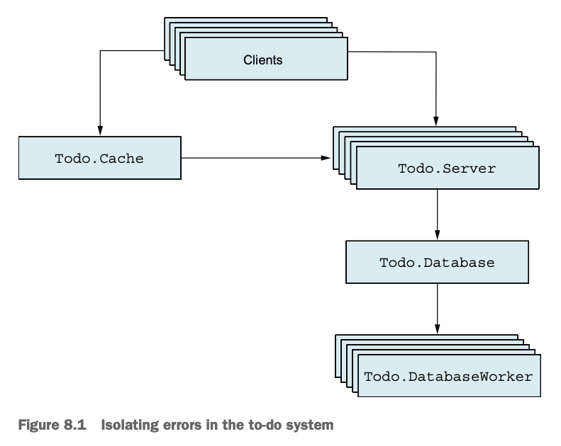
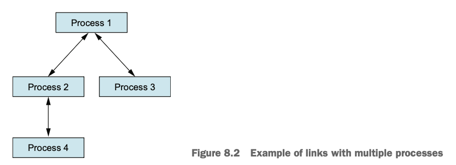
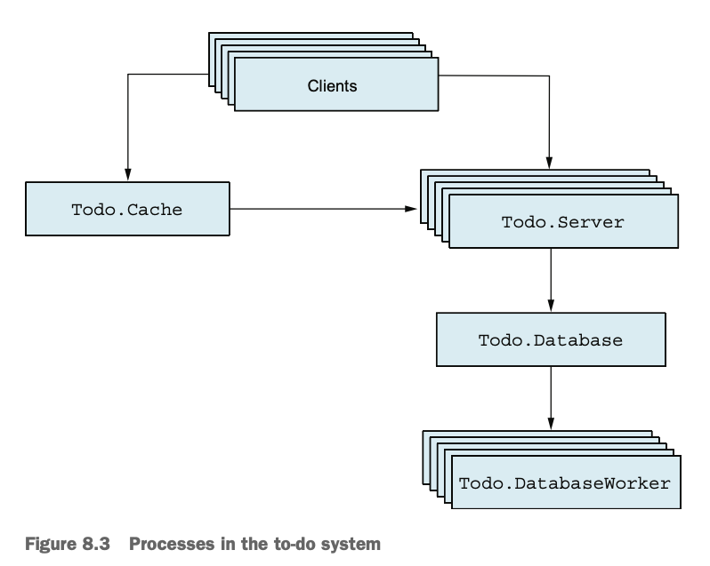
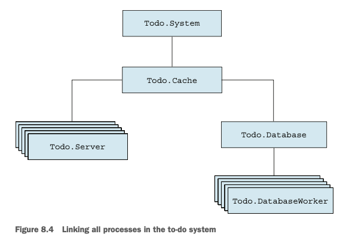

# 8장 — 장애 허용(fault tolerance) 기본 개념

- [8장 — 장애 허용(fault tolerance) 기본 개념](#8장--장애-허용fault-tolerance-기본-개념)
  - [1. 장애 허용의 개념](#1-장애-허용의-개념)
  - [2. 런타임 오류 (Run-time Errors)](#2-런타임-오류-run-time-errors)
    - [2.1 오류의 종류](#21-오류의-종류)
    - [2.2 `try/catch`를 이용한 오류 처리](#22-trycatch를-이용한-오류-처리)
  - [3. 동시성 시스템에서의 오류](#3-동시성-시스템에서의-오류)
    - [3.1 프로세스 격리 (Process Isolation)](#31-프로세스-격리-process-isolation)
    - [3.2 프로세스 링크 (Linking)](#32-프로세스-링크-linking)
    - [3.3 종료 트랩 (Trapping Exits)](#33-종료-트랩-trapping-exits)
    - [3.4 모니터 (Monitors)](#34-모니터-monitors)
  - [4. 슈퍼바이저 (Supervisors)](#4-슈퍼바이저-supervisors)
    - [4.1 역할](#41-역할)
    - [4.2 슈퍼바이저 시작하기](#42-슈퍼바이저-시작하기)
    - [4.3 자식 명세 (Child Specification)](#43-자식-명세-child-specification)
    - [4.4 슈퍼바이저 래핑](#44-슈퍼바이저-래핑)
    - [4.5 콜백 기반 슈퍼바이저](#45-콜백-기반-슈퍼바이저)
    - [4.6 모든 프로세스 연결하기](#46-모든-프로세스-연결하기)
    - [4.7 재시작 빈도 (Restart Frequency)](#47-재시작-빈도-restart-frequency)
  - [💡 핵심 요약](#-핵심-요약)

---

## 1. 장애 허용의 개념

* **장애 허용(fault tolerance)** 이란 시스템이 런타임 오류가 발생하더라도 계속 안정적으로 동작할 수 있도록 하는 능력이다.
* 시스템이 복잡해질수록 오류는 피할 수 없으며, 하드웨어 고장·과부하·네트워크 단절 등 다양한 문제가 발생할 수 있다.
* 목표는 **“모든 게 망가져도 가능한 한 서비스를 유지하고 자동으로 복구하는 것.”**
* 예: 데이터베이스 서버가 죽더라도 캐시 데이터를 제공하고, 요청을 큐에 쌓아두었다가 복구 후 반영할 수 있다.
* **핵심 철학**

  * 오류를 완전히 없애려 하지 말고, **영향을 최소화하고 자동으로 복구**하라.
  * 하나의 큰 오류보다 여러 개의 작은, 고립된 오류가 낫다.
* **BEAM(Elixir/Erlang VM)의 핵심은 동시성**

  * 프로세스 간 **완전한 메모리 분리**.
  * 한 프로세스의 크래시가 다른 프로세스에 영향을 주지 않는다.

---

## 2. 런타임 오류 (Run-time Errors)

### 2.1 오류의 종류

BEAM은 런타임 오류를 세 가지로 구분한다:

* `:error` — 일반적인 예외 (예: 1/0, 정의되지 않은 함수 호출 등)
* `:exit` — 명시적인 프로세스 종료 (`exit/1`)
* `:throw` — 비지역 반환 (깊은 재귀나 루프를 탈출할 때 사용, 권장되지 않음)

Elixir 관례:

* `!`가 붙은 함수(`File.open!`)는 오류 발생 시 예외를 **던짐**.
* `!`가 없는 버전(`File.open`)은 결과를 **튜플로 반환** (`{:ok, result}` / `{:error, reason}`).

### 2.2 `try/catch`를 이용한 오류 처리

```elixir
try do
  ...
catch type, value ->
  ...
end
```

* `type`은 `:error`, `:exit`, `:throw` 중 하나.
* `value`는 발생한 오류 값.
* `after` 블록은 항상 실행되며 리소스 정리에 사용.
* 패턴 매칭으로 특정 오류만 처리 가능:

  ```elixir
  catch :throw, {:result, x} -> x
  ```
* `try`의 반환값은 `do` 또는 `catch` 블록의 마지막 표현식 결과.
* **주의:** `try`가 함수의 마지막 문장이면 **tail-call 최적화가 불가능**하다.
* Elixir 철학: 모든 오류를 처리하지 말고 **“그냥 죽게 놔두고”** 새 프로세스를 재시작하라.

---

## 3. 동시성 시스템에서의 오류



### 3.1 프로세스 격리 (Process Isolation)

* 각 BEAM 프로세스는 **독립적으로 실행**되며, 한 프로세스의 크래시가 다른 프로세스에 영향을 주지 않는다.
* 부모 프로세스가 죽어도 자식 프로세스는 정상 동작.
* 메모리를 공유하지 않아 **메모리 오염 위험이 없음**.

### 3.2 프로세스 링크 (Linking)



* **링크(link)** 는 두 프로세스를 연결해 한쪽이 죽으면 다른 쪽에 **종료 신호(exit signal)** 를 전달한다.
* 생성 방법:

  ```elixir
  Process.link(pid)
  spawn_link(fn -> ... end)
  ```
* 한 프로세스가 비정상 종료하면, 링크된 프로세스도 기본적으로 함께 종료됨.
* 링크는 **양방향**이며, **두 프로세스 간 하나의 링크**만 존재.

### 3.3 종료 트랩 (Trapping Exits)

* 링크로 인해 함께 죽는 것을 방지하려면 **트랩 모드**를 설정:

  ```elixir
  Process.flag(:trap_exit, true)
  ```
* 종료 신호가 메시지로 들어옴:

  ```elixir
  {:EXIT, from_pid, reason}
  ```
* 프로세스 크래시를 감지하여 **로그 남기기 / 복구 작업** 수행 가능.

### 3.4 모니터 (Monitors)

* **모니터**는 한 방향으로만 작동하며, 프로세스가 죽어도 모니터링 프로세스는 영향을 받지 않는다.
* 생성:

  ```elixir
  ref = Process.monitor(pid)
  ```
* 대상 프로세스가 죽으면 메시지 수신:

  ```elixir
  {:DOWN, ref, :process, pid, reason}
  ```
* `GenServer.call` 내부에서도 사용되어 서버 크래시를 감지한다.

---

## 4. 슈퍼바이저 (Supervisors)



### 4.1 역할

* **슈퍼바이저**는 다른 프로세스(=자식)를 관리하고, 죽은 프로세스를 자동 재시작한다.
* 실제 일을 하는 것은 **워커(worker)** 프로세스이고, 슈퍼바이저는 **감시자** 역할.
* 시작 예시:

  ```elixir
  Supervisor.start_link([Todo.Cache], strategy: :one_for_one)
  ```
* `:one_for_one` 전략: 한 자식이 죽으면 **그 자식만 재시작**.

### 4.2 슈퍼바이저 시작하기

* 자식 프로세스 목록을 지정하여 슈퍼바이저를 시작:

  ```elixir
  Supervisor.start_link([Todo.Cache], strategy: :one_for_one)
  ```
* 자식은 보통 `start_link/1` 함수를 가져야 함.
* 프로세스가 재시작되면 PID가 바뀌므로, **등록 이름(name: **MODULE**)** 을 반드시 사용해야 한다.

### 4.3 자식 명세 (Child Specification)

```elixir
%{
  id: Todo.Cache,
  start: {Todo.Cache, :start_link, [nil]}
}
```

* `id`: 자식 식별자.
* `start`: `{모듈, 함수, 인자}` 형태로 시작 방법 명시.
* `use GenServer` 시 기본 `child_spec/1`이 자동 생성됨.
* 따라서 단순히 `[Todo.Cache]`만 넘겨도 동작한다.

### 4.4 슈퍼바이저 래핑

```elixir
defmodule Todo.System do
  def start_link do
    Supervisor.start_link([Todo.Cache], strategy: :one_for_one)
  end
end
```

* 시스템 전체를 시작하는 **엔트리 포인트 역할** 수행.

### 4.5 콜백 기반 슈퍼바이저

```elixir
defmodule Todo.System do
  use Supervisor
  def start_link, do: Supervisor.start_link(__MODULE__, nil)
  def init(_), do: Supervisor.init([Todo.Cache], strategy: :one_for_one)
end
```

* `init/1`을 통해 자식 및 옵션을 설정.
* **핫 코드 교체**나 초기화 로직 추가 시 유용.

### 4.6 모든 프로세스 연결하기



* `Cache`, `Server`, `Database` 등을 **모두 링크**해야 함.
* 한 곳의 오류 → 전체 트리 종료 → 슈퍼바이저가 전체 구조를 재시작.
* 모든 모듈의 `start` → `start_link`로 변경:

  ```elixir
  def start_link(...) do
    GenServer.start_link(...)
  end
  ```
* 덕분에 시스템이 자동으로 **“자기 치유(self-healing)”** 함.

### 4.7 재시작 빈도 (Restart Frequency)

* 슈퍼바이저는 무한정 재시작하지 않는다.
* 기본 설정: **5초 내 3회 초과 재시작 시 슈퍼바이저도 종료.**
* 변경 가능:

  ```elixir
  Supervisor.start_link(children, strategy: :one_for_one, max_restarts: 5, max_seconds: 10)
  ```
* 이유: 재시작이 잦다는 것은 **근본적인 오류**를 의미하므로 시스템 전체를 중단시키는 것이 낫다.

---

## 💡 핵심 요약

* **장애 허용은 오류 예방이 아니라 오류 관리 기술**이다.
* BEAM의 **프로세스 격리**가 안정성의 핵심.
* Elixir는 **“죽게 놔두고 재시작하라 (Let it crash)”** 철학을 따른다.
* **링크**는 상호 연결, **모니터**는 단방향 감시.
* **슈퍼바이저**는 자식 프로세스를 자동 재시작하는 시스템의 보호막.
* 모든 워커는 `start_link`를 통해 연결되어야 한다.
* **재시작 제한(max_restarts)** 을 넘으면 슈퍼바이저도 종료 — 무한 루프 방지.
