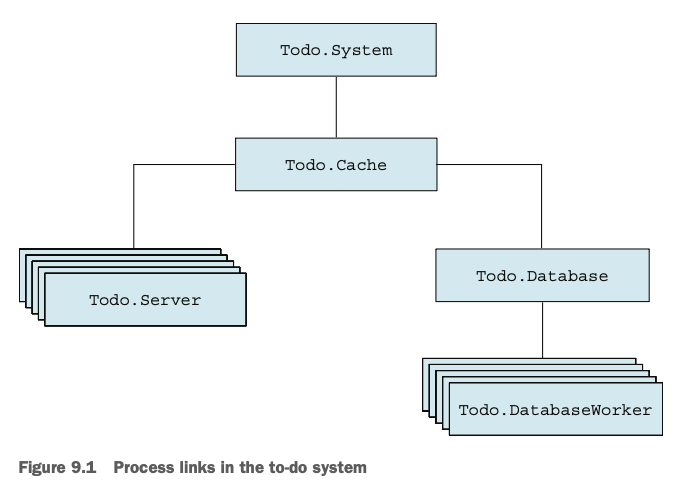
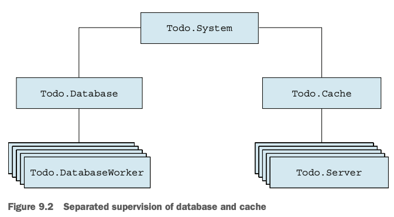
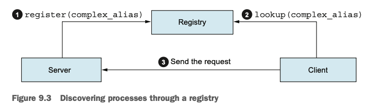
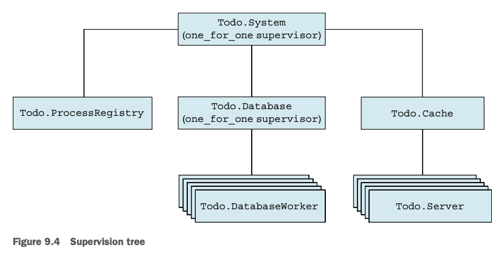
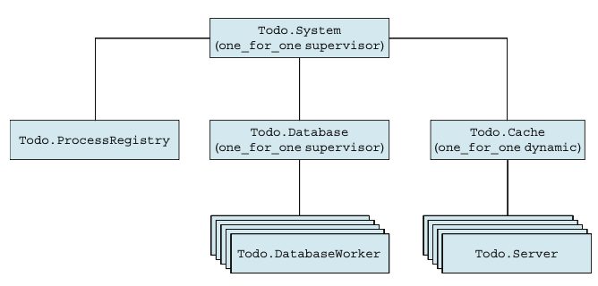

# Chapter 9. Isolating Error Effects

- [Chapter 9. Isolating Error Effects](#chapter-9-isolating-error-effects)
  - [1. Error Isolation and Availability](#1-error-isolation-and-availability)
  - [2. Supervision Trees](#2-supervision-trees)
    - [Separating Loosely Dependent Parts](#separating-loosely-dependent-parts)
    - [Rich Process Discovery](#rich-process-discovery)
    - [Via Tuples](#via-tuples)
    - [Registering Database Workers](#registering-database-workers)
    - [Supervising Database Workers](#supervising-database-workers)
    - [Organizing the Supervision Tree](#organizing-the-supervision-tree)
    - [OTP-Compliant Processes](#otp-compliant-processes)
    - [Shutting Down Processes](#shutting-down-processes)
    - [Avoiding Process Restarting](#avoiding-process-restarting)
    - [Restart Strategies](#restart-strategies)
  - [3. Starting Processes Dynamically](#3-starting-processes-dynamically)
    - [Registering To-Do Servers](#registering-to-do-servers)
    - [Dynamic Supervision](#dynamic-supervision)
    - [Finding To-Do Servers](#finding-to-do-servers)
    - [Using the Temporary Restart Strategy](#using-the-temporary-restart-strategy)
  - [4. “Let It Crash” Philosophy](#4-let-it-crash-philosophy)
    - [Processes That Shouldn’t Crash](#processes-that-shouldnt-crash)
    - [Handling Expected Errors](#handling-expected-errors)
    - [Preserving the State](#preserving-the-state)
  - [Key Takeaways](#key-takeaways)

---

## 1. Error Isolation and Availability

* **Goal:** Confine the impact of errors to individual workers, ensuring system availability.
* Example: A **database crash** shouldn’t stop the **cache** from serving clients.
* **Supervisors** isolate failure scopes by restarting only failed components.

---

## 2. Supervision Trees

### Separating Loosely Dependent Parts




* If workers are started within other workers, **errors propagate too broadly**.
* Solution: Start each worker directly under a **supervisor** (using `:one_for_one` strategy).
* Allows **individual restarts** — cache and database errors are isolated.

### Rich Process Discovery



* Problem: When workers are supervised, you lose direct access to their **PIDs**.
* Solution: Use **Registry** to map symbolic names to process PIDs.
* Registry can use **complex keys** (e.g., `{:database_worker, 1}`), unlike atom-based naming.

### Via Tuples

* **`{:via, Module, data}`** tuples integrate registries with OTP processes.
* GenServers can be named using custom registries via tuples like
  `{:via, Registry, {:my_registry, {EchoServer, id}}}`.
* Enables name-based discovery and communication with supervised processes.

### Registering Database Workers

* Introduce `Todo.ProcessRegistry` to supervise a `Registry` process.
* Workers are registered via:

  ```elixir
  Todo.ProcessRegistry.via_tuple({Todo.DatabaseWorker, id})
  ```
* Registry must start **before** workers in the supervision list.

### Supervising Database Workers

* Convert `Todo.Database` from a GenServer to a **supervisor**.
* Spawns multiple `Todo.DatabaseWorker`s using unique child specs.
* Workers registered with keys like `{Todo.DatabaseWorker, id}` via registry.
* Supervisor hierarchy:

  ```
  Todo.System
   ├─ Todo.ProcessRegistry
   ├─ Todo.Database (Supervisor)
   │   ├─ Worker 1
   │   ├─ Worker 2
   │   └─ Worker 3
   └─ Todo.Cache
  ```
* Isolates database errors without impacting cache or registry.

### Organizing the Supervision Tree



* Supervisors act as **service managers** — start, stop, and monitor child services.
* Allows **controlled shutdown**: stopping one subtree doesn’t affect others.
* **Restart escalation:**

  * Worker crash → restarted locally.
  * Frequent failures → restart supervisor subtree.
  * Unrecoverable → propagate upward.

### OTP-Compliant Processes

* Supervisors should only manage **OTP-compliant** processes (e.g., GenServer, Supervisor, Task, Agent).
* Non-OTP `spawn_link` processes must be encapsulated by workers.

### Shutting Down Processes

* `:shutdown` option defines how long to wait for graceful termination.

  * Integer → milliseconds
  * `:infinity` → wait forever
  * `:brutal_kill` → immediate termination
* Default: 5s for workers, `:infinity` for supervisors.

### Avoiding Process Restarting

* Modify restart policy via `restart:` option:

  * `:temporary` → never restarted.
  * `:transient` → restarted only if abnormal exit.
  * Default → always restarted.

### Restart Strategies

* `:one_for_one` → restart only the crashed child.
* `:one_for_all` → restart all children when one crashes.
* `:rest_for_one` → restart the crashed child and its younger siblings.
* Choose based on **dependency strength** between children.

---

## 3. Starting Processes Dynamically

### Registering To-Do Servers

* To-do servers use `via_tuple` for registration:

  ```elixir
  {:via, Registry, {Todo.ProcessRegistry, {Todo.Server, name}}}
  ```
* Prevents naming collisions between database workers and to-do servers.

### Dynamic Supervision



* `DynamicSupervisor` allows **on-demand** child creation.
* `Todo.Cache` becomes a dynamic supervisor:

  ```elixir
  DynamicSupervisor.start_child(__MODULE__, {Todo.Server, name})
  ```
* Handles concurrent child creation safely and serially.

### Finding To-Do Servers

* Implements **lazy initialization**: starts a to-do server only when needed.

  ```elixir
  case start_child(name) do
    {:ok, pid} -> pid
    {:error, {:already_started, pid}} -> pid
  end
  ```
* Ensures no race conditions even with simultaneous requests.

### Using the Temporary Restart Strategy

* To-do servers are defined as:

  ```elixir
  use GenServer, restart: :temporary
  ```
* **Rationale:** Servers are demand-driven; if they crash, they’ll restart on next use.
* Benefits:

  * Prevents cascading restarts.
  * Ensures graceful system shutdown via supervised structure.

---

## 4. “Let It Crash” Philosophy

### Processes That Shouldn’t Crash

* **Error Kernel:** Critical processes that hold essential state.
* Keep logic minimal; offload complex work to secondary processes.
* Optionally wrap `handle_*` callbacks with `try/catch` for rollback safety.

### Handling Expected Errors

* Handle predictable failures explicitly (e.g., missing files).

  ```elixir
  case File.read(file) do
    {:ok, contents} -> ...
    {:error, :enoent} -> nil
  end
  ```
* Let unexpected errors crash → supervisor handles recovery.

### Preserving the State

* Restarted processes start clean (stateless recovery).
* Persist critical state **externally** (e.g., in database).
* Persist only **after** successful transformations to ensure consistency.
* Beware of persisting corrupted state → can cause crash loops.

---

## Key Takeaways

* **Supervisors isolate faults** — restart only what’s broken, not the entire system.
* **Registries + via tuples** enable flexible, name-based process discovery.
* **DynamicSupervisors** manage unpredictable, on-demand processes efficiently.
* Use **temporary workers** for ephemeral tasks and **transient** for one-off jobs.
* The **“Let it crash”** principle simplifies code and embraces self-healing.
* Handle **expected errors explicitly**, but trust supervisors for recovery.
* **Persistence ≠ safety** — always validate state consistency before saving.
